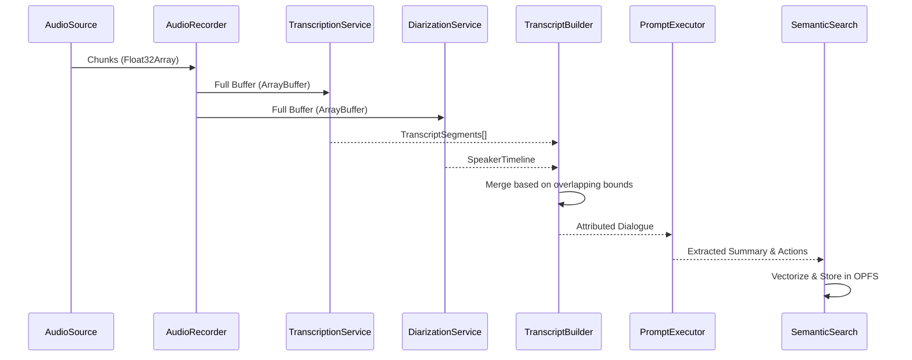

# Watchn't AI Meeting Copilot

**Watchn't** is a local-first, privacy-focused AI meeting copilot built natively as a browser extension. It captures tab audio, transcribes it, extracts actionable intelligence (summaries, decisions, action items), and retains semantic memory entirely within the browser.

## Ultimate Architecture (V3)

The architecture is strictly separated into Domain, AI, Platform, and Foundation layers, ensuring UI components (apps) contain zero business logic.

```mermaid
graph TD
    %% Apps Layer
    subgraph UI [Apps Layer]
        ext[Chrome Extension]
        web[Web App]
    end

    %% Platform Core
    subgraph PlatformCore [Platform Layer (Core)]
        core[Core Runtime]
    end

    %% Domain Layer
    subgraph Domain [Domain Layer]
        meet[Meeting Aggregate]
        exp[Export & Email]
    end

    %% AI Layer
    subgraph AI [AI Layer]
        aud[Audio Pipeline]
        trans[Transcription]
        diar[Diarization]
        intell[Intelligence / Prompting]
        mem[Semantic Memory & Search]
        emb[Embeddings]
    end

    %% Platform Infrastructure
    subgraph PlatformInfra [Platform Layer (Infra)]
        stor[OPFS / Memory Storage]
        prov[LLM Providers]
    end

    %% Flow
    ext --> core
    web --> core
    
    core --> meet
    core --> aud
    
    aud --> trans
    trans --> intell
    diar --> intell
    
    intell --> meet
    intell --> mem
    mem --> emb
    mem --> stor
    
    meet --> exp
    
    intell --> prov
```

## Data Pipeline

The AI extraction follows a strict sequential pipeline over immutable chunks of data:



## Setup & Development
\`\`\`bash
pnpm install
pnpm build
pnpm test
\`\`\`
