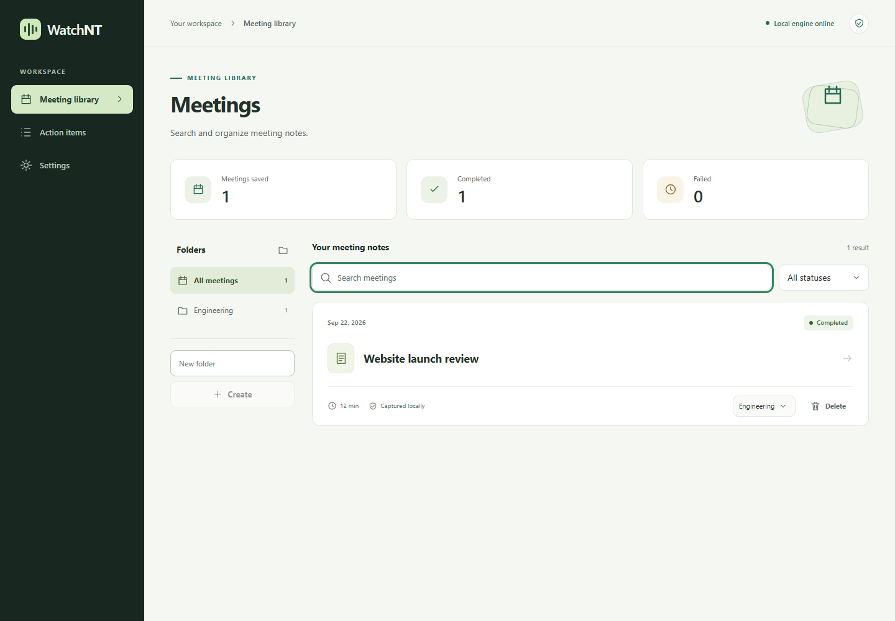
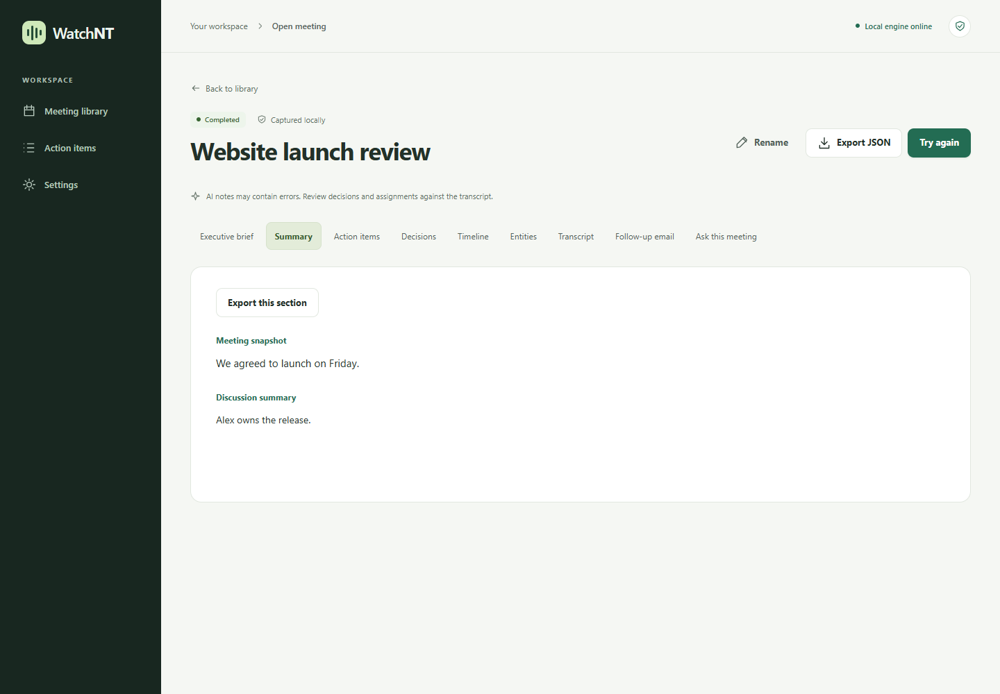
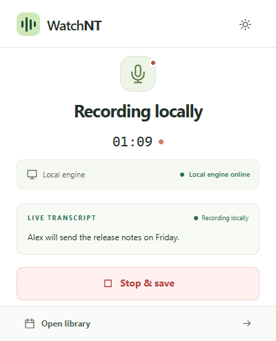

<div align="center">
  
  <h1>WatchNT</h1>
  <p><strong>Local-first meeting capture, transcription, and AI notes.</strong></p>
  <p>A Chromium extension and self-hosted API for searchable transcripts, summaries, and action items.</p>
  <p><a href="#quickstart">Quickstart</a> · <a href="#ai-providers">AI providers</a> · <a href="#development">Development</a> · <a href="#documentation">Documentation</a></p>
</div>

## Overview

WatchNT captures meeting-tab audio or live captions from Google Meet, Zoom Web, and Microsoft Teams Web. Speech recognition runs locally with Whisper. Use local Ollama for AI processing, or connect a cloud provider with your own API key and explicit text-processing consent.

- **Capture:** meeting audio, optional microphone input, live transcript preview, and a separate captions mode.
- **Review:** briefs, summaries, action items, decisions, timelines, entities, and follow-up email drafts.
- **Organize:** a local meeting library, folders, transcript search, and persistent action-item completion.
- **Export:** JSON meeting data, Markdown sections, and CSV action items.
- **Recover:** saved transcripts, incremental AI results, and retries for failed sections.
- **Localize:** English and Spanish interfaces with independent spoken-language selection.

WatchNT has no required subscription. Optional cloud APIs are billed by their providers.

## Preview

<div align="center">
  
  <p><em>Find, filter, and organize meeting notes in a local workspace.</em></p>
</div>

<details>
<summary>Meeting detail and capture controls</summary>
<br />

<div align="center">
  
  <p><em>Review structured AI notes alongside the original transcript.</em></p>
</div>

<div align="center">
  
  <p><em>Control capture and follow the live transcript from the toolbar popup.</em></p>
</div>

Screenshots use sample meeting data.

</details>

<details>
<summary>Watch the original demo</summary>
<br />

<div align="center">
  <a href="https://www.youtube.com/watch?v=gLmGs812cEA">
    
  </a>
  <p><em>A walkthrough of the capture workflow; the demo shows an earlier interface.</em></p>
</div>

</details>

## Quickstart

**Requirements:** Docker with Compose, a Chromium browser, and internet access for the first model download. On Windows, run Docker Desktop with Linux containers.

### 1. Start the application

```sh
git clone https://github.com/avirooppal/Watchnt.git
cd Watchnt
docker compose up
```

Compose builds the extension, starts Ollama, initializes SQLite, downloads missing model weights, and starts the API at **http://localhost:8000**. No host Python, Node.js, or Ollama installation is required. Wait for `Application startup complete` in the backend logs; first startup can take several minutes.

Fresh installations use Whisper `base` and Ollama `qwen3:1.7b` on CPU. Models and meeting data persist between runs. Use `docker compose up -d` for background operation.

### 2. Load the extension

1. Open `chrome://extensions` and enable **Developer mode**.
2. Select **Load unpacked** and choose `Watchnt/extension/dist`.
3. Pin WatchNT, open its toolbar popup, and complete setup.
4. Allow microphone access if you want your own voice included alongside meeting-tab audio.

After a rebuild, click **Reload** on the installed extension. Docker builds the extension but cannot install or reload it in your browser.

### 3. Capture a meeting

Open a supported meeting tab and start capture from the **extension toolbar popup**. Choose local audio transcription, or enable the meeting platform's captions before using captions mode. Stop from the popup or floating controller, then open the meeting to review and export results.

## AI providers

Select a provider in **Settings**, enter a model ID available to your account, and run **Test connections**. Cloud providers also require an API key and explicit consent to process transcript text.

| Mode | Supported providers |
| --- | --- |
| Local | Ollama |
| Cloud | Ollama Cloud, OpenAI, Anthropic / Claude, Google Gemini, Groq, OpenRouter |
| Cloud | DeepSeek, Mistral AI, Together AI, Fireworks AI, Cerebras, xAI / Grok |

Each provider links to its model documentation. Switching providers resets consent and the previous model selection. Providers without a default model require an explicit model ID.

**Ollama Cloud** connects directly to `https://ollama.com/api/chat`. Use its API model ID, such as `gemma4:31b`, rather than a local `:cloud` alias. A saved cloud selection needs no local LLM download. See [Ollama Cloud documentation](https://docs.ollama.com/cloud).

## Architecture

The extension streams audio to the local API for transcription. Saved transcript text passes through the selected LLM provider for schema-validated extraction. SQLite stores settings and meeting metadata; local files store transcripts and generated artifacts.

| Component | Implementation |
| --- | --- |
| Browser extension | Manifest V3, React, TypeScript, Vite, Tailwind CSS |
| API and validation | FastAPI, Uvicorn, Pydantic |
| Speech recognition | Faster-Whisper, local VAD, CPU int8 inference |
| AI processing | Provider adapters, prompt registry, validated JSON outputs |
| Storage | SQLite, SQLAlchemy, local files |
| Runtime | Docker Compose or native Python and Node.js |

```text
backend/
  api/          HTTP and WebSocket endpoints
  database/     SQLite models and additive migrations
  schemas/      Request and response contracts
  services/     Transcription, AI providers, and processing pipeline
extension/
  src/          Popup, dashboard, capture, and background worker
  dist/         Generated unpacked extension
scripts/        Browser and integration checks
docs/           Development, operations, and architecture notes
docker-compose.yml
```

## Privacy and storage

- Audio transcription runs locally. The live capture path processes audio in memory and does not archive it.
- Local Ollama keeps AI processing on your machine. A selected cloud provider receives transcript text for requested AI features after consent.
- API keys remain in the local backend and are masked in settings responses. Stored keys and meeting data are not encrypted at rest.
- Docker persists settings in `data/watchnt.db`, artifacts in `meetings/`, and model weights in named volumes.
- Email drafts can be exported; SMTP sending is disabled.

See the [operations guide](docs/OPERATIONS.md) for storage paths, backups, migration, and service lifecycle commands.

## Development

For native setup, use Python **3.10+** and Node.js **22.12+**. Full setup instructions are in the [development guide](docs/DEVELOPMENT.md).

After installing dependencies, run checks from the repository root:

```sh
python -m pytest backend/tests -q
npm run build --prefix extension
npm run lint --prefix extension
```

Backend tests isolate databases and meeting files. Browser checks cover onboarding, capture states, recovery, accessibility, and actual toolbar-popup sizing. Cloud protocol tests use simulated responses; passing them does not establish live provider availability.

## Documentation

| Guide | Contents |
| --- | --- |
| [Development](docs/DEVELOPMENT.md) | Native setup, build commands, tests, and contributions |
| [Operations](docs/OPERATIONS.md) | Docker lifecycle, configuration, backups, migration, and troubleshooting |
| [Engine architecture](docs/ENGINE_UPGRADE.md) | Processing design, privacy boundaries, and verification scope |
| [UI system](docs/UI_DESIGN.md) | Shared components, accessibility, and browser verification |

## Known limitations

Live transcription windows can split words or miss rapid language changes. Audio channels distinguish **Me / Others**, not individual remote speakers. Caption capture depends on each platform's current DOM. Long-meeting context management, multilingual accuracy benchmarks, and broader live-call testing remain ongoing work.

Cloud models can be unavailable or rate-limited. Failed processing keeps the saved transcript and completed sections available for review and retry. Review generated notes against the transcript before relying on them.

For bugs and feature requests, use [GitHub Issues](https://github.com/avirooppal/Watchnt/issues). Contribution and validation guidance is in the [development guide](docs/DEVELOPMENT.md#contributing).
