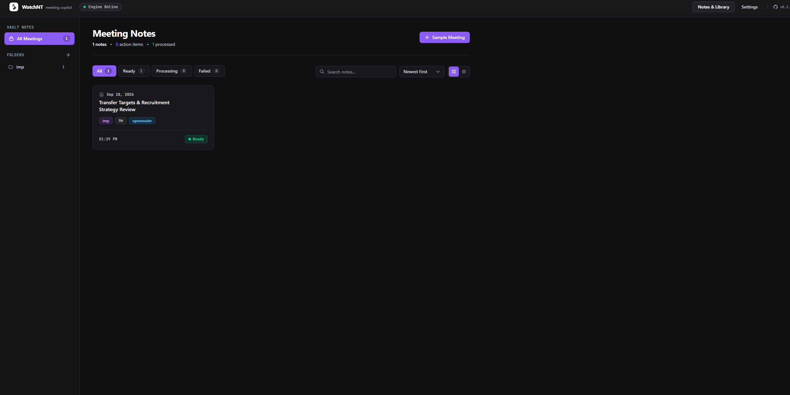
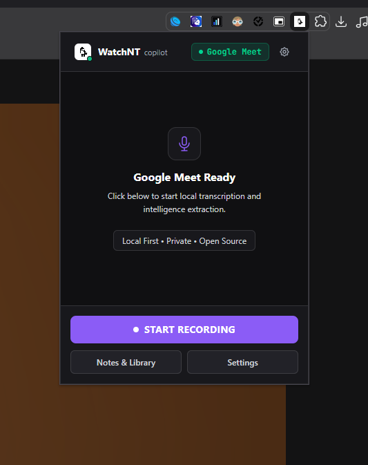
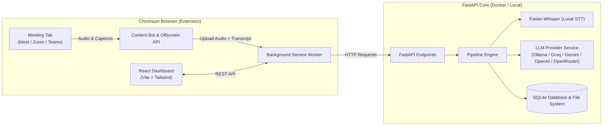

<div align="center">
  
  <h1>WatchNT</h1>
  <p><strong>Local-First, Zero-Subscription AI Meeting Copilot & Intelligence Engine</strong></p>
  <p>Record, transcribe, analyze, and extract action items from Google Meet, Zoom, and Microsoft Teams without sending audio or transcripts to third-party SaaS vendors.</p>

  <p>
    <a href="https://github.com/avirooppal/Watchnt/releases"></a>
    <a href="https://github.com/avirooppal/Watchnt/blob/main/LICENSE"></a>
    <a href="https://github.com/avirooppal/Watchnt/stargazers"></a>
    <a href="https://github.com/avirooppal/Watchnt/issues"></a>
    <a href="https://github.com/avirooppal/Watchnt/network/members"></a>
  </p>

  [](https://www.youtube.com/watch?v=gLmGs812cEA&autoplay=1)
</div>

---

## Overview

**WatchNT** is an open-source, privacy-first meeting assistant engineered to eliminate recurring SaaS transcription costs. Combining a Chromium browser extension with a containerized FastAPI backend, WatchNT captures system audio and live captions during active calls, runs local or custom-provider speech-to-text, and executes a structured intelligence pipeline to generate executive summaries, task matrices, decisions, and follow-up emails.

### Key Highlights

- **Privacy-Preserving & Local Storage**: Raw audio, transcripts, and metadata reside locally on your machine in SQLite and disk storage.
- **True BYOK (Bring Your Own Keys)**: Native support for zero-cost local LLMs (**Ollama**) or direct API integration with **Groq**, **OpenAI**, **Google Gemini**, and **OpenRouter**.
- **Universal Web Platform Support**: Compatible with Google Meet, Zoom Web, and Microsoft Teams Web via Manifest V3 browser capture.
- **Resilient AI Pipeline**: Multi-stage parallel prompt registry enforcing strict Pydantic JSON schemas with automated backoff retries.
- **Export Ready**: Instant generation of Markdown summaries and structured CSV action items.

---

## Visual Tour

<div align="center">
  
  <p><em>WatchNT Meeting Intelligence Dashboard — Key decisions, task matrices, timelines, and entity extraction</em></p>
</div>

<br />

<div align="center">
  
  <p><em>In-call floating recording controller with real-time status telemetry</em></p>
</div>

---

## Architecture



### Pipeline Workflow

1. **Capture**: The browser extension offscreen document taps active tab audio and captures live caption streams.
2. **Transfer**: The background service worker packages audio and transcript payloads to the FastAPI backend.
3. **Speech-to-Text**: High-speed, local transcription using `faster-whisper`.
4. **Intelligence Extraction**: The engine runs parallel prompt passes with schema validation:
   - Executive Brief & Meeting Snapshot
   - Discussion Summary & Key Decisions
   - Action Items Matrix (assignee, priority, due date, confidence, evidence quote)
   - Topic Milestones & Timestamped Timeline
   - Entity Recognition (people, products, technologies, dates)
   - Follow-up Email Draft
5. **Review & Export**: Interactive review via the extension dashboard with one-click Markdown and CSV exports.

---

## Tech Stack

| Layer | Technologies |
|---|---|
| **Extension & UI** | React 19, TypeScript, Vite, TailwindCSS v4, CRXJS (Manifest V3) |
| **Backend API** | Python 3.10, FastAPI, Uvicorn, Pydantic v2, SQLAlchemy |
| **Speech-to-Text** | Faster-Whisper, FFmpeg |
| **AI / LLM Runtime** | Ollama (Local), Groq, OpenAI, Google Gemini, OpenRouter |
| **Database & Storage** | SQLite, Local Filesystem Volumes |
| **Containerization** | Docker, Docker Compose |

---

## Getting Started

### Prerequisites

- [Docker](https://docs.docker.com/get-docker/) and [Docker Compose](https://docs.docker.com/compose/)
- [Node.js](https://nodejs.org/) (v18 or newer) & `npm`
- *(Optional for fully local inference)*: [Ollama](https://ollama.com/) running on host (e.g. `ollama run llama3.2`)

---

### Step 1: Start the Backend Service

#### Option A: Docker Compose (Recommended)

Clone the repository and run the containerized backend:

```bash
git clone https://github.com/avirooppal/Watchnt.git
cd Watchnt

# Build and start services in detached mode
docker compose up --build -d
```

The backend will be available at `http://localhost:8000`. Test the health check endpoint:

```bash
curl http://localhost:8000/api/health
```

#### Option B: Manual Local Setup (Without Docker)

Ensure `ffmpeg` is installed on your system PATH, then:

```bash
cd backend
python -m venv venv

# Windows
.\venv\Scripts\activate

# macOS / Linux
source venv/bin/activate

pip install -r requirements.txt
uvicorn main:app --host 0.0.0.0 --port 8000 --reload
```

---

### Step 2: Build and Install the Browser Extension

1. Navigate to the extension directory and install dependencies:

```bash
cd extension
npm install
npm run build
```

2. Load into your Chromium browser (Chrome, Brave, Edge):
   - Open your browser and navigate to `chrome://extensions/`.
   - Toggle **Developer mode** in the top-right corner.
   - Click **Load unpacked**.
   - Select the `Watchnt/extension/dist` folder.
   - Pin the **WatchNT** icon to your browser extension bar.

---

### Step 3: Configure LLM Provider (BYOK)

1. Click the WatchNT extension icon and open **Settings** (or open the Dashboard at any time).
2. Choose your preferred LLM provider:
   - **Ollama**: Enter your base URL (default: `http://localhost:11434` or `http://host.docker.internal:11434`) and model name (e.g., `llama3.2`, `mistral`, `qwen2.5`).
   - **Groq**: Enter your Groq API key and select your model (e.g., `llama-3.3-70b-versatile`).
   - **OpenAI**: Enter your OpenAI API key and model (e.g., `gpt-4o-mini`).
   - **Google Gemini**: Enter your Gemini API key and model (e.g., `gemini-1.5-flash`).
   - **OpenRouter**: Enter your OpenRouter API key and model identifier.
3. Save settings. Your credentials remain stored locally on your machine.

---

## Operating Guide

1. **Enter Meeting**: Open an active meeting in Google Meet, Zoom Web, or Microsoft Teams Web.
2. **Start Session**: Click the WatchNT extension icon and select **Start Recording**. When prompted by the browser, select the current meeting tab and ensure **Share audio** is enabled.
3. **Monitor Live**: A non-intrusive floating indicator will display in the bottom corner of your meeting with real-time capture status.
4. **End & Process**: Click **Stop Recording**. The extension will automatically transmit the session data to your local backend engine for transcription and intelligence extraction.
5. **Access Insights**: Open the WatchNT Dashboard to review summaries, edit action items, filter past meetings by folder, and export documentation in Markdown or CSV formats.

---

## Folder Structure

```
Watchnt/
├── backend/
│   ├── api/             # FastAPI routing (meetings, settings, folders, pipeline)
│   ├── core/            # Logging and configuration
│   ├── database/        # SQLAlchemy database engine and ORM models
│   ├── schemas/         # Pydantic data contracts and validation schemas
│   ├── services/        # Pipeline orchestration, STT, LLM factory, prompt registry
│   ├── Dockerfile       # Container definition
│   └── requirements.txt # Python dependencies
├── extension/
│   ├── src/
│   │   ├── components/  # Reusable UI component system
│   │   ├── content/     # Meeting tab injection and floating bot UI
│   │   ├── dashboard/   # Intelligence dashboard, settings, meeting detail views
│   │   ├── popup/       # Extension popup controller
│   │   └── services/    # Export service, API client, background messaging
│   ├── manifest.json    # Chrome Manifest V3 configuration
│   └── package.json     # Extension build scripts and dependencies
├── docker-compose.yml   # Multi-container orchestration
└── README.md
```

---

## Contributing

Contributions, bug reports, and feature proposals are welcome.

1. Fork the repository.
2. Create a feature branch (`git checkout -b feature/amazing-feature`).
3. Commit your changes (`git commit -m 'feat: add amazing feature'`).
4. Push to the branch (`git push origin feature/amazing-feature`).
5. Open a Pull Request.

Please see the [Issues page](https://github.com/avirooppal/Watchnt/issues) for planned roadmap items and known issues.

---

## License

Distributed under the MIT License. See [LICENSE](LICENSE) for more details.
