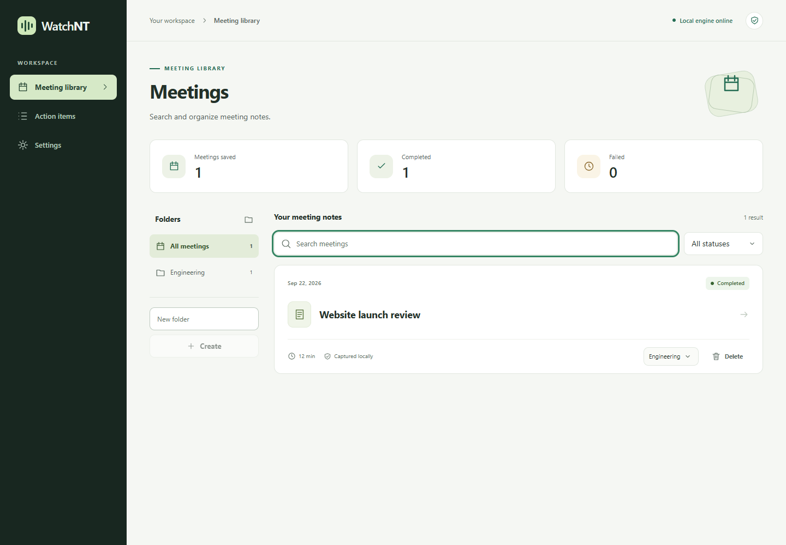
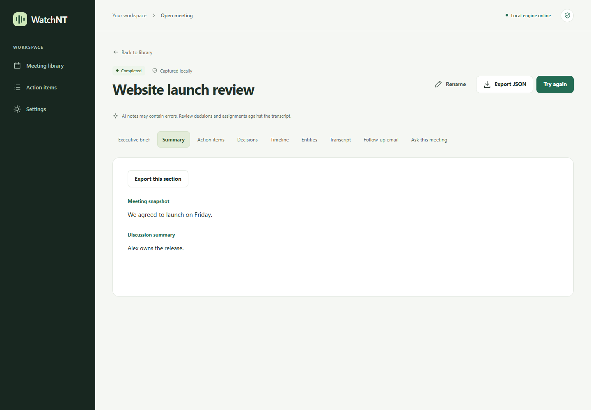
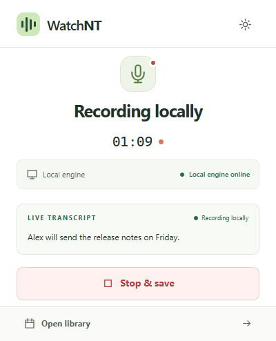

<div align="center">
  
  <h1>WatchNT</h1>
  <p><strong>Local-first meeting capture, transcription, and AI notes.</strong></p>
  <p>A Chromium extension and self-hosted API for searchable transcripts, summaries, and action items.</p>
  <p><a href="#quickstart">Quickstart</a> · <a href="#ai-providers">AI providers</a> · <a href="#development">Development</a> · <a href="#documentation">Documentation</a></p>
</div>

## Overview

WatchNT records the visible meeting tab and its audio in Google Meet, Zoom Web, and Microsoft Teams Web. Speech recognition runs locally with Whisper. Use local Ollama for AI processing, or connect a cloud provider with your own API key and explicit text-processing consent.

- **Capture:** Start capture records the meeting-tab video, meeting audio, your microphone, and audio from presentations shared by the meeting page, while transcribing speech live. Presentations and shared screens are recorded as shown in the meeting tab.
- **Generate only what you need:** choose briefs, summaries, action items, decisions, timelines, entities, follow-up email drafts, or optional transcript cleanup after recording.
- **Customize:** edit each output prompt in Settings; ask meeting questions on demand.
- **Organize:** a local meeting library, folders, transcript search, and persistent action-item completion.
- **Export:** JSON meeting data, Markdown sections, and CSV action items.
- **Recover:** saved transcripts, incremental AI results, and retries for failed sections.
- **Localize:** English and Spanish interfaces with independent spoken-language selection.

WatchNT has no required subscription. Optional cloud APIs are billed by their providers.

## Preview

<div align="center">
  
  <p><em>Find, filter, and organize meeting notes in a local workspace.</em></p>
</div>

<details>
<summary>Meeting detail and capture controls</summary>
<br />

<div align="center">
  
  <p><em>Review structured AI notes alongside the original transcript.</em></p>
</div>

<div align="center">
  
  <p><em>Control capture and follow the live transcript from the toolbar popup.</em></p>
</div>

Screenshots use sample meeting data.

</details>

<details>
<summary>Watch the original demo</summary>
<br />

<div align="center">
  <a href="https://www.youtube.com/watch?v=gLmGs812cEA">
    
  </a>
  <p><em>A walkthrough of the capture workflow; the demo shows an earlier interface.</em></p>
</div>

</details>

## Quickstart

**Requirements:** Docker with Compose, a Chromium browser, and internet access for the first model download. On Windows, run Docker Desktop with Linux containers.

### 1. Start the application

```sh
git clone https://github.com/avirooppal/Watchnt.git
cd Watchnt
docker compose up
```

Compose builds the extension, starts Ollama, initializes SQLite, downloads missing model weights, and starts the API at **http://localhost:8000**. No host Python, Node.js, or Ollama installation is required. Wait for `Application startup complete` in the backend logs; first startup can take several minutes.

Fresh installations use Whisper `base` and Ollama `qwen3:1.7b` on CPU. Models and meeting data persist between runs. Use `docker compose up -d` for background operation.

### 2. Load the extension

1. Open `chrome://extensions` and enable **Developer mode**.
2. Select **Load unpacked** and choose `Watchnt/extension/dist`.
3. Pin WatchNT, open its toolbar popup, and complete setup.
4. Allow microphone access to include your voice; recording setup will request it if needed.

After a rebuild, click **Reload** on the installed extension. Docker builds the extension but cannot install or reload it in your browser.

### 3. Capture a meeting

WatchNT keeps recording controls in the toolbar, with no in-meeting reminder overlay. Click **Start capture** in its toolbar popup. The browser recorder captures the original meeting tab and continues when you switch tabs or close the popup. Your microphone uses the meeting website's permission; allow it once if prompted. **Stop & save** finalizes the video and original transcript. Select **Open meeting**, choose your outputs, and click **Generate selected**. No AI notes or titles are generated automatically. No Windows recorder or desktop screen picker is used for new recordings.

Browser capture uses the extension service worker to start `tabCapture`, an offscreen document for recording, and a local WebRTC connection for microphone and outgoing presentation audio. A document-start hook observes media the meeting page obtains through its normal `getDisplayMedia` request; WatchNT does not open its own screen picker. Audio is connected only after Start. Stop closes WatchNT's microphone/connection without stopping the meeting's shared presentation. Reload existing meeting tabs once after installing or updating the extension so the hook is present before presenting.

Scope: the saved video is the visible meeting tab. Hidden camera tiles and slides are not separately captured. Outgoing presentation audio requires the meeting page to obtain an audio track when you share; enable audio in the meeting's own presentation control. Unshared audio from unrelated tabs or desktop apps is outside this browser meeting capture. Live provider compatibility still requires testing on Meet, Zoom, and Teams; the automated fixture verifies actual tab capture, local WebRTC, transcription, and recording.

### 4. Choose outputs and customize prompts

Stopping a recording saves the original transcript without requesting AI notes or an AI title. Open the meeting, select the outputs you need, and click **Generate selected**. Existing outputs remain available; selecting a generated output explicitly regenerates it. **Ask this meeting** runs only when a question is submitted. Optional **Transcript cleanup** creates a separate readable version and never replaces the original transcript.

In **Settings → Output prompts**, expand a section to edit its instructions or restore the default. Prompts apply to future requests, including regeneration. `{transcript}` inserts the original evidence; evidence is appended if the placeholder is omitted. Structured output validation remains enabled. **Advanced settings** contains the local speech model and recording recovery controls.

After updating, restart the backend to apply the additive settings migration and reload the extension.

## AI providers

Select a provider in **Settings**, enter a model ID available to your account, and run **Test connections**. Cloud providers also require an API key and explicit consent to process transcript text.

| Mode | Supported providers |
| --- | --- |
| Local | Ollama |
| Cloud | Ollama Cloud, OpenAI, Anthropic / Claude, Google Gemini, Groq, OpenRouter |
| Cloud | DeepSeek, Mistral AI, Together AI, Fireworks AI, Cerebras, xAI / Grok |

Each provider links to its model documentation. Switching providers resets consent and the previous model selection. Providers without a default model require an explicit model ID.

**Ollama Cloud** connects directly to `https://ollama.com/api/chat`. Use its API model ID, such as `gemma4:31b`, rather than a local `:cloud` alias. A saved cloud selection needs no local LLM download. See [Ollama Cloud documentation](https://docs.ollama.com/cloud).

## Architecture

The extension streams audio to the local API for transcription. Only explicitly requested outputs send saved transcript text through the selected LLM provider for schema-validated extraction. SQLite stores settings and meeting metadata; local files store WebM recordings, transcripts, and generated artifacts. Video is saved incrementally while capture runs.

| Component | Implementation |
| --- | --- |
| Browser extension | Manifest V3, React, TypeScript, Vite, Tailwind CSS |
| API and validation | FastAPI, Uvicorn, Pydantic |
| Speech recognition | Faster-Whisper, local VAD, CPU int8 inference |
| AI processing | Provider adapters, prompt registry, validated JSON outputs |
| Storage | SQLite, SQLAlchemy, local files |
| Runtime | Docker Compose or native Python and Node.js |

```text
backend/
  api/          HTTP and WebSocket endpoints
  database/     SQLite models and additive migrations
  schemas/      Request and response contracts
  services/     Transcription, AI providers, and processing pipeline
extension/
  src/          Popup, dashboard, capture, and background worker
  dist/         Generated unpacked extension
companion/      Legacy Windows recorder and recovery support (optional)
scripts/        Browser and integration checks
docs/           Development, operations, and architecture notes
docker-compose.yml
```

## Privacy and storage

- Audio transcription runs locally. Video and mixed audio are saved locally as WebM recordings. Received chunks are retained if saving is interrupted; incomplete recordings may require recovery. Deleting a meeting also deletes its recording.
- Local Ollama keeps AI processing on your machine. A selected cloud provider receives transcript text for requested AI features after consent.
- API keys remain in the local backend and are masked in settings responses. Stored keys and meeting data are not encrypted at rest.
- Docker persists settings in `data/watchnt.db`, artifacts in `meetings/`, and model weights in named volumes.
- Email drafts can be exported; SMTP sending is disabled.

See the [operations guide](docs/OPERATIONS.md) for storage paths, backups, migration, and service lifecycle commands.

## Development

For native setup, use Python **3.10+** and Node.js **22.12+**. Full setup instructions are in the [development guide](docs/DEVELOPMENT.md).

After installing dependencies, run checks from the repository root:

```sh
python -m pytest backend/tests -q
npm run build --prefix extension
npm run lint --prefix extension
```

Backend tests isolate databases and meeting files. Selection tests verify zero AI calls on save, generation of selected outputs only, prompt persistence, and preservation of the original transcript. Browser checks cover onboarding, capture states, recovery, accessibility, and actual toolbar-popup sizing. Cloud protocol tests use simulated responses; passing them does not establish live provider availability.

Useful browser checks (require Python Playwright and its Chromium runtime):

```sh
python scripts/ui_smoke.py
python scripts/popup_recovery_smoke.py
python scripts/toolbar_smoke.py
```

Generated builds, browser screenshots, meeting data, credentials, model weights, and local recorder recovery files are excluded from Git. Keep these files local; `.gitignore` does not remove files already tracked by Git.

## Documentation

| Guide | Contents |
| --- | --- |
| [Development](docs/DEVELOPMENT.md) | Native setup, build commands, tests, and contributions |
| [Operations](docs/OPERATIONS.md) | Docker lifecycle, configuration, backups, migration, and troubleshooting |
| [Engine architecture](docs/ENGINE_UPGRADE.md) | Processing design, privacy boundaries, and verification scope |
| [UI system](docs/UI_DESIGN.md) | Shared components, accessibility, and browser verification |

## Known limitations

Live transcription windows can split words or miss rapid language changes. Audio channels distinguish **Me / Others**, not individual remote speakers. Caption capture depends on each platform's current DOM. Long-meeting context management, multilingual accuracy benchmarks, and broader live-call testing remain ongoing work.

Cloud models can be unavailable or rate-limited. Failed processing keeps the saved transcript and completed sections available for review and retry. Review generated notes against the transcript before relying on them.

For bugs and feature requests, use [GitHub Issues](https://github.com/avirooppal/Watchnt/issues). Contribution and validation guidance is in the [development guide](docs/DEVELOPMENT.md#contributing).
