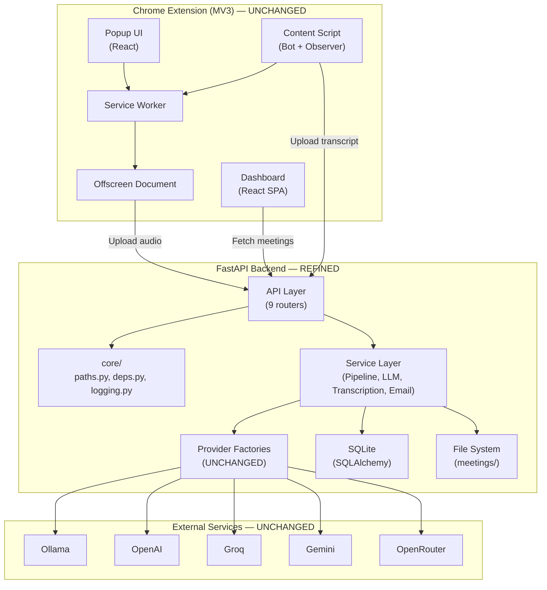

# WatchNT Modernization — Implementation Specification

> **Document Type:** Implementation Blueprint (Single Source of Truth)  
> **Created:** 2026-07-05  
> **Status:** Awaiting Approval  
> **Target:** Implementation LLM

---

# 1 Executive Summary

## Project Vision

WatchNT is a privacy-first, open-source AI Meeting Copilot. It runs as a Chrome Extension paired with a local FastAPI backend. Users join Google Meet calls, WatchNT captures live captions via DOM scraping, then processes the transcript through a configurable AI pipeline (summarize → extract actions → generate email draft). All processing can run locally with Ollama + Faster-Whisper, or via cloud providers (OpenAI, Groq, Gemini, OpenRouter). Users bring their own API keys.

## Modernization Goals

1. **Fix critical security vulnerabilities** — CORS, XSS, plaintext API keys
2. **Fix broken UI** — Popup and Toast components use CSS class names that do not exist in the Tailwind v4 theme
3. **Eliminate dead code** — Unused Vite template files, committed artifacts, one-off scripts
4. **Reduce duplication** — Centralize `get_db()`, path constants, pipeline logic, markdown stripping
5. **Improve reliability** — Proper HTTP status codes, structured logging, error boundaries
6. **Improve maintainability** — Consolidate Tailwind config, pin dependencies, clean imports
7. **Improve UX** — Keyboard accessibility on Select, meeting card actions visible on focus

## Expected End State

The same product, with:

- Zero broken CSS classes
- Zero dead code files
- Zero duplicated utility functions
- Proper security posture (restricted CORS, sanitized HTML output, masked API keys)
- Structured logging instead of `print()`
- Clean, consistent Tailwind v4 theming
- All existing features working identically to current behavior
- Cleaner codebase that is easier to extend

## What Does NOT Change

- The Chrome Extension + FastAPI architecture
- The provider factory pattern (LLM and Transcription)
- The file-based artifact storage (`meetings/` directory)
- SQLite as the database
- The caption-scraping approach for Google Meet
- The React component library and design language
- The dark "Signal System" theme aesthetic
- The onboarding wizard flow
- The dashboard routing structure
- The `shared/types/` directory
- The offscreen document architecture
- The extension manifest permissions

---

# 2 Design Principles

1. **Preserve behavior** — Every change must maintain existing user-facing functionality
2. **Typed everywhere** — No `any` types where a concrete type can be defined
3. **No duplicated logic** — Every utility, constant, and dependency exists in exactly one place
4. **Secure by default** — CORS restricted, HTML sanitized, keys masked, inputs validated
5. **Accessible** — All interactive elements reachable via keyboard, semantic HTML, ARIA labels on icon buttons
6. **Composition over inheritance** — Prefer small, composable components and functions
7. **One responsibility per module** — Each file has a single, clear purpose
8. **Incremental migration** — Every phase leaves the project in a fully working state
9. **No unnecessary dependencies** — Do not add libraries unless solving a specific identified problem
10. **Consistent naming** — All CSS classes use the `@theme` design token names, never `watchnt-*` legacy names

---

# 3 Target Architecture

The target architecture is identical to the current architecture with these specific refinements:



### What Changes

| Subsystem                                   | Change                                                     | Reason                                                                                 |
| ------------------------------------------- | ---------------------------------------------------------- | -------------------------------------------------------------------------------------- |
| `backend/core/`                             | NEW directory with `deps.py`, `paths.py`, `logging.py`     | Eliminate duplication of `get_db()`, `BASE_DIR`, `MEETINGS_DIR`, and `print()` logging |
| `backend/main.py`                           | CORS origins restricted                                    | Security: audit finding P0                                                             |
| `backend/schemas/config.py`                 | API key fields masked in response                          | Security: audit finding P0                                                             |
| `backend/services/pipeline_service.py`      | Deduplicate `process_meeting()` and `process_transcript()` | Code smell: 80% identical code                                                         |
| `extension/src/popup/Popup.tsx`             | Replace `watchnt-*` classes with `@theme` token classes    | Broken UI: classes do not resolve                                                      |
| `extension/src/contexts/ToastContext.tsx`   | Replace `watchnt-*` classes with `@theme` token classes    | Broken UI: classes do not resolve                                                      |
| `extension/src/dashboard/MeetingDetail.tsx` | Replace `dangerouslySetInnerHTML` with text rendering      | Security: XSS vulnerability                                                            |
| Dead files                                  | REMOVED                                                    | Dead code: Vite template leftovers                                                     |

### What Does NOT Change

| Subsystem                                                         | Status                                        |
| ----------------------------------------------------------------- | --------------------------------------------- |
| Provider factories (`llm_factory.py`, `transcription_factory.py`) | PRESERVED — already well-designed             |
| All 5 LLM provider implementations                                | PRESERVED                                     |
| All 3 transcription provider implementations                      | PRESERVED                                     |
| Observer/caption scraping (`observer.ts`)                         | PRESERVED                                     |
| Bot overlay (`Bot.tsx`)                                           | PRESERVED                                     |
| Dashboard routing and layout                                      | PRESERVED                                     |
| All shared types                                                  | PRESERVED                                     |
| Extension manifest                                                | PRESERVED                                     |
| Docker configuration                                              | PRESERVED                                     |
| Vite configuration                                                | PRESERVED (only `tailwind.config.js` removed) |
| Component library (Badge, Button, Card, Input, Skeleton)          | PRESERVED                                     |

---

# 4 Current → Target Migration

## 4.1 Backend Dependency Injection (`get_db()`)

**Current:** `get_db()` is defined identically in 3 files: `api/meeting.py:L9-14`, `api/upload.py:L15-20`, `api/config.py:L12-17`.

**Problems:** Code duplication. If the session logic changes, 3 files must be updated.

**Target:** Single `get_db()` function in `backend/core/deps.py`. All 3 router files import from there.

**Migration Strategy:**

1. Create `backend/core/__init__.py` (empty)
2. Create `backend/core/deps.py` containing the `get_db()` function
3. In each of the 3 router files, delete the local `get_db()` and add `from core.deps import get_db`

**Files Involved:**

- NEW: `backend/core/__init__.py`
- NEW: `backend/core/deps.py`
- MODIFY: `backend/api/meeting.py` — remove lines 9-14, add import
- MODIFY: `backend/api/upload.py` — remove lines 15-20, add import
- MODIFY: `backend/api/config.py` — remove lines 12-17, add import

**Expected Result:** `get_db()` exists in exactly one place. All routers import it.

---

## 4.2 Backend Path Constants

**Current:** `BASE_DIR` and `MEETINGS_DIR` are computed identically in 7 files: `api/meeting.py:L19-20`, `api/upload.py:L22-23`, `api/actions.py:L9-10`, `api/transcribe.py`, `api/summary.py`, `services/pipeline_service.py:L11-12`, `services/email_service.py`.

**Problems:** Same 2-line pattern repeated 7 times. Fragile if directory structure changes.

**Target:** Single `MEETINGS_DIR` constant in `backend/core/paths.py`.

**Migration Strategy:**

1. Create `backend/core/paths.py` with `BASE_DIR` and `MEETINGS_DIR`
2. In each of the 7 files, delete the local `BASE_DIR`/`MEETINGS_DIR` lines and add `from core.paths import MEETINGS_DIR`
3. Remove now-unnecessary `import os` lines where `os` was only used for path computation

**Files Involved:**

- NEW: `backend/core/paths.py`
- MODIFY: `backend/api/meeting.py` — remove lines 19-20
- MODIFY: `backend/api/upload.py` — remove lines 22-23
- MODIFY: `backend/api/actions.py` — remove lines 9-10
- MODIFY: `backend/api/transcribe.py` — remove equivalent lines
- MODIFY: `backend/api/summary.py` — remove equivalent lines
- MODIFY: `backend/services/pipeline_service.py` — remove lines 11-12
- MODIFY: `backend/services/email_service.py` — remove equivalent lines

**Expected Result:** `MEETINGS_DIR` is defined once. All files import it.

---

## 4.3 Tailwind Configuration

**Current:** Design tokens are defined in TWO places:

- `extension/tailwind.config.js` (Tailwind v3 format)
- `extension/src/index.css` `@theme` block (Tailwind v4 format)

The project uses `@tailwindcss/vite` v4, so `tailwind.config.js` is ignored.

**Problems:** Developers may edit the wrong config. The v3 config creates false sense of what tokens exist.

**Target:** Delete `tailwind.config.js`. All tokens live in `@theme` in `index.css` (which is already the case).

**Migration Strategy:**

1. Delete `extension/tailwind.config.js`
2. Verify the extension still builds with `npm run build`

**Files Involved:**

- DELETE: `extension/tailwind.config.js`

**Expected Result:** Single source of truth for design tokens in `index.css`.

---

## 4.4 CSS Class Migration (Popup + Toast)

**Current:** `Popup.tsx` uses 26 instances of `watchnt-*` class names (e.g., `watchnt-bg`, `watchnt-surface`, `watchnt-border`, `watchnt-accent`, `watchnt-text`, `watchnt-text-muted`, `watchnt-error`, `watchnt-success`). `ToastContext.tsx` uses 7 instances of `watchnt-*` class names.

**Problems:** These class names do not exist in the Tailwind v4 `@theme`. The components render with no styling applied to those classes.

**Target:** Replace every `watchnt-*` class with its `@theme` equivalent.

**Exact mapping (derived from `replace-tokens.cjs`):**

| Current Class           | Target Class            |
| ----------------------- | ----------------------- |
| `watchnt-bg`            | `signal-ink`            |
| `watchnt-surface`       | `signal-surface`        |
| `watchnt-surface-hover` | `signal-surface-raised` |
| `watchnt-accent`        | `accent-amber`          |
| `watchnt-accent-light`  | `accent-amber-dim`      |
| `watchnt-text`          | `text-primary`          |
| `watchnt-text-muted`    | `text-muted`            |
| `watchnt-border`        | `border-hairline`       |
| `watchnt-border-hover`  | `white/20`              |
| `watchnt-error`         | `state-danger`          |
| `watchnt-success`       | `state-success`         |

**Migration Strategy:**

1. In `Popup.tsx`, find-and-replace every `watchnt-*` class using the mapping above
2. In `ToastContext.tsx`, find-and-replace every `watchnt-*` class using the mapping above
3. Build the extension and verify both popup and toasts render correctly

**Files Involved:**

- MODIFY: `extension/src/popup/Popup.tsx`
- MODIFY: `extension/src/contexts/ToastContext.tsx`

**Expected Result:** All classes resolve to valid Tailwind v4 utility classes. Components are visually styled.

---

## 4.5 Pipeline Deduplication

**Current:** `pipeline_service.py` has two methods: `process_meeting()` (lines 30-79) and `process_transcript()` (lines 81-124). Lines 53-79 and 98-124 are functionally identical — they run summarize → extract actions → generate email.

**Problems:** If the pipeline logic changes, two places must be updated. Bug-prone.

**Target:** Extract the shared logic into a private `_run_llm_pipeline(self, meeting_id: str, segments: list)` method. Both public methods call it.

**Migration Strategy:**

1. Create `_run_llm_pipeline(self, meeting_id: str, segments: list)` containing lines 53-75 (the summarize→actions→email logic)
2. Modify `process_meeting()` to call `self._run_llm_pipeline(meeting_id, segments)` after transcription
3. Modify `process_transcript()` to call `self._run_llm_pipeline(meeting_id, segments)` after loading transcript
4. Delete the duplicated code blocks

**Files Involved:**

- MODIFY: `backend/services/pipeline_service.py`

**Expected Result:** Shared pipeline logic exists in exactly one method. Both entry points produce identical results.

---

## 4.6 XSS Remediation

**Current:** `MeetingDetail.tsx` uses `dangerouslySetInnerHTML` at lines 183 and 267 to render LLM-generated summary and email content.

**Problems:** LLM output could contain `<script>` tags or malicious HTML. This is a direct XSS vector.

**Target:** Replace `dangerouslySetInnerHTML={{ __html: summary.replace(/\n/g, '<br/>') }}` with safe text rendering that preserves line breaks using CSS `whitespace-pre-wrap`.

**Migration Strategy:**

1. In `MeetingDetail.tsx` line 183, replace the `<div dangerouslySetInnerHTML=...>` with `<div className="whitespace-pre-wrap">{summary}</div>`
2. In `MeetingDetail.tsx` line 267, replace the `<div dangerouslySetInnerHTML=...>` with `<div className="whitespace-pre-wrap">{email}</div>`
3. Both replacements preserve the existing wrapper `className` attributes — only the content rendering changes

**Files Involved:**

- MODIFY: `extension/src/dashboard/MeetingDetail.tsx`

**Expected Result:** LLM output is rendered as plain text with preserved line breaks. No HTML is interpreted. XSS is eliminated.

---

# 5 Folder Structure

```
Watchnt/
├── backend/
│   ├── main.py
│   ├── config.py
│   ├── Dockerfile
│   ├── requirements.txt                          ← MODIFIED (pinned versions)
│   ├── .gitignore                                ← NEW
│   ├── core/                                     ← NEW
│   │   ├── __init__.py                           ← NEW
│   │   ├── deps.py                               ← NEW (get_db)
│   │   ├── paths.py                              ← NEW (BASE_DIR, MEETINGS_DIR)
│   │   └── logging.py                            ← NEW (get_logger)
│   ├── api/
│   │   ├── health.py
│   │   ├── meeting.py                            ← MODIFIED (remove local get_db, paths, fix HTTP status)
│   │   ├── upload.py                             ← MODIFIED (remove local get_db, paths, fix inline import)
│   │   ├── transcribe.py                         ← MODIFIED (remove local paths)
│   │   ├── summary.py                            ← MODIFIED (remove local paths)
│   │   ├── actions.py                            ← MODIFIED (remove local paths, remove duplicate md stripping)
│   │   ├── email.py
│   │   ├── realtime.py
│   │   └── config.py                             ← MODIFIED (remove local get_db, mask keys in response)
│   ├── database/
│   │   ├── db.py
│   │   └── models.py                             ← MODIFIED (fix deprecated utcnow)
│   ├── schemas/
│   │   ├── meeting.py
│   │   ├── status.py
│   │   └── config.py                             ← MODIFIED (add masked response model)
│   └── services/
│       ├── pipeline_service.py                   ← MODIFIED (deduplicate, use core imports, structured logging)
│       ├── llm_service.py                        ← MODIFIED (use core imports)
│       ├── transcription_service.py
│       ├── email_service.py                      ← MODIFIED (use core imports)
│       └── providers/                            ← UNCHANGED
│           ├── llm_factory.py
│           ├── transcription_factory.py
│           ├── llm/
│           │   ├── base.py
│           │   ├── ollama.py
│           │   ├── openai.py
│           │   ├── groq.py
│           │   ├── gemini.py
│           │   └── openrouter.py
│           └── transcription/
│               ├── base.py
│               ├── local_whisper.py
│               ├── groq_whisper.py
│               └── openai_whisper.py
├── extension/
│   ├── manifest.json                             ← UNCHANGED
│   ├── index.html
│   ├── dashboard.html                            ← MODIFIED (add lang, charset)
│   ├── offscreen.html
│   ├── offscreen.js
│   ├── package.json
│   ├── vite.config.ts
│   ├── .oxlintrc.json
│   ├── tailwind.config.js                        ← REMOVED
│   ├── test.css                                  ← REMOVED
│   ├── replace-tokens.cjs                        ← REMOVED
│   ├── README.md
│   ├── src/
│   │   ├── main.tsx                              ← REMOVED (dead code)
│   │   ├── App.tsx                               ← REMOVED (dead code)
│   │   ├── App.css                               ← REMOVED (dead code)
│   │   ├── index.css                             ← MODIFIED (add slide-up, shimmer, waveform animations)
│   │   ├── popup/
│   │   │   ├── index.tsx
│   │   │   └── Popup.tsx                         ← MODIFIED (fix CSS classes)
│   │   ├── background/
│   │   │   └── index.ts
│   │   ├── content/
│   │   │   ├── index.tsx
│   │   │   ├── Bot.tsx
│   │   │   ├── base.ts
│   │   │   ├── googleMeet.ts
│   │   │   └── observer.ts
│   │   ├── dashboard/
│   │   │   ├── index.tsx
│   │   │   ├── Layout.tsx
│   │   │   ├── MeetingList.tsx                   ← MODIFIED (useMemo, a11y)
│   │   │   ├── MeetingDetail.tsx                 ← MODIFIED (XSS fix, type safety)
│   │   │   ├── Settings.tsx
│   │   │   └── Onboarding.tsx
│   │   ├── components/
│   │   │   ├── Badge.tsx
│   │   │   ├── Button.tsx
│   │   │   ├── Card.tsx
│   │   │   ├── Input.tsx
│   │   │   ├── Select.tsx                        ← MODIFIED (keyboard nav, ARIA)
│   │   │   └── Skeleton.tsx
│   │   └── contexts/
│   │       └── ToastContext.tsx                   ← MODIFIED (fix CSS classes)
│   └── public/
├── shared/                                       ← UNCHANGED
│   └── types/
│       ├── index.ts
│       ├── meeting.ts
│       ├── status.ts
│       ├── action.ts
│       ├── email.ts
│       └── transcript.ts
├── docker-compose.yml
├── .gitignore                                    ← MODIFIED (add watchnt.db, *.mp4, test.css)
├── logo.png
├── logo.jpg
└── watchnt.mp4                                   ← REMOVED from tracking (add to .gitignore)
```

---

# 6 Feature Breakdown

## Feature 1: Meeting Recording (Caption Scraping)

**Purpose:** Capture live captions from Google Meet via DOM observation.

**Current Implementation:** `observer.ts` uses `MutationObserver` on `div[role="region"][tabindex="0"]`. Works correctly.

**Problems:** None identified that are within scope. The Google Meet DOM dependency is an inherent risk but not something we change.

**New Implementation:** NO CHANGES. This subsystem is well-designed and functional.

**Acceptance Criteria:** After all modernization phases, caption scraping continues to work identically.

---

## Feature 2: AI Pipeline Processing

**Purpose:** Orchestrate summarization, action extraction, and email generation.

**Current Implementation:** `pipeline_service.py` with two methods sharing 80% identical code.

**Problems:** Code duplication between `process_meeting()` and `process_transcript()`.

**New Implementation:** Extract shared logic into `_run_llm_pipeline()`. Both methods call it.

**Files:** `backend/services/pipeline_service.py`

**Dependencies:** Core paths module (TASK-003)

**Acceptance Criteria:**

- `process_meeting()` produces identical output files as before
- `process_transcript()` produces identical output files as before
- The shared code block exists exactly once
- Pipeline status updates remain in the same order

---

## Feature 3: Multi-Provider LLM Support

**Purpose:** Support 5 LLM providers via factory pattern.

**Current Implementation:** `LLMProviderFactory.create()` returns the correct provider based on settings.

**Problems:** None. The factory pattern and provider implementations are clean.

**New Implementation:** NO CHANGES to provider layer.

**Acceptance Criteria:** All 5 providers continue to work.

---

## Feature 4: Dashboard

**Purpose:** View meeting library, meeting details, settings, and onboarding.

**Current Implementation:** React SPA with `HashRouter`, 4 routes.

**Problems:**

- `dangerouslySetInnerHTML` XSS vulnerability in `MeetingDetail.tsx`
- `any` types in `MeetingDetail.tsx` state
- No `useMemo` on filtered/sorted meetings in `MeetingList.tsx`
- Action buttons not keyboard accessible in `MeetingList.tsx`

**New Implementation:** Fix XSS, add types, add `useMemo`, add keyboard accessibility.

**Files:** `MeetingDetail.tsx`, `MeetingList.tsx`

**Acceptance Criteria:**

- Summary and email render as plain text (no HTML interpretation)
- Meeting list filtering/sorting is memoized
- Delete/rename buttons are reachable via Tab key
- All existing functionality preserved

---

## Feature 5: Extension Popup

**Purpose:** Start/stop recording, view pipeline progress, open dashboard.

**Current Implementation:** `Popup.tsx` with full recording controls and pipeline step visualization.

**Problems:** All `watchnt-*` CSS classes are non-functional (do not resolve in Tailwind v4).

**New Implementation:** Replace every `watchnt-*` class with its `@theme` equivalent per the mapping in Section 4.4.

**Files:** `extension/src/popup/Popup.tsx`

**Acceptance Criteria:**

- Every visual element in the popup is correctly styled
- Colors, borders, backgrounds, and text colors match the design system
- All existing functionality preserved (start, stop, timer, pipeline visualization)

---

# 7 UI Modernization

## 7.1 Popup

**Layout:** Fixed 340×480px container. Header + main content area + footer. UNCHANGED.

**CSS Fix Required:** Replace all `watchnt-*` class names. Specific replacements:

| Line(s)  | Current                                                                                                                                                  | Target                                                                                                                                   |
| -------- | -------------------------------------------------------------------------------------------------------------------------------------------------------- | ---------------------------------------------------------------------------------------------------------------------------------------- |
| L91      | `bg-watchnt-surface border-watchnt-border`                                                                                                               | `bg-signal-surface border-border-hairline`                                                                                               |
| L92      | `text-watchnt-text-muted`                                                                                                                                | `text-text-muted`                                                                                                                        |
| L97      | `text-watchnt-text`, `text-watchnt-success`, `text-watchnt-text-muted/50`                                                                                | `text-text-primary`, `text-state-success`, `text-text-muted/50`                                                                          |
| L102     | `bg-watchnt-accent`                                                                                                                                      | `bg-accent-amber`                                                                                                                        |
| L105     | `text-watchnt-error`                                                                                                                                     | `text-state-danger`                                                                                                                      |
| L118     | `bg-watchnt-bg text-watchnt-text`                                                                                                                        | `bg-signal-ink text-text-primary`                                                                                                        |
| L119     | `border-watchnt-border bg-watchnt-bg`                                                                                                                    | `border-border-hairline bg-signal-ink`                                                                                                   |
| L125     | `text-watchnt-success`                                                                                                                                   | `text-state-success`                                                                                                                     |
| L130     | `text-watchnt-text-muted`                                                                                                                                | `text-text-muted`                                                                                                                        |
| L131     | `bg-watchnt-text-muted/50`                                                                                                                               | `bg-text-muted/50`                                                                                                                       |
| L140     | `text-watchnt-error`                                                                                                                                     | `text-state-danger`                                                                                                                      |
| L141     | `bg-watchnt-error`                                                                                                                                       | `bg-state-danger`                                                                                                                        |
| L149     | `bg-watchnt-accent`                                                                                                                                      | `bg-accent-amber`                                                                                                                        |
| L164     | `border-watchnt-border bg-watchnt-bg`                                                                                                                    | `border-border-hairline bg-signal-ink`                                                                                                   |
| L169-172 | `ring-watchnt-accent/50`, `bg-watchnt-accent`, `hover:bg-watchnt-accent-light`, `bg-watchnt-surface`, `text-watchnt-text-muted`, `border-watchnt-border` | `ring-accent-amber/50`, `bg-accent-amber`, `hover:bg-accent-amber-dim`, `bg-signal-surface`, `text-text-muted`, `border-border-hairline` |
| L180     | `border-watchnt-error/30 text-watchnt-error hover:bg-watchnt-error/10 ring-watchnt-error/50`                                                             | `border-state-danger/30 text-state-danger hover:bg-state-danger/10 ring-state-danger/50`                                                 |
| L187     | `hover:bg-watchnt-surface text-watchnt-text-muted hover:text-watchnt-text`                                                                               | `hover:bg-signal-surface text-text-muted hover:text-text-primary`                                                                        |
| L155     | `text-watchnt-text-muted`                                                                                                                                | `text-text-muted`                                                                                                                        |

**Animations:** The popup uses `animate-waveform`, `animate-fade-in`, and `animate-pulse`. `animate-fade-in` is defined in `@theme`. `animate-pulse` is built-in Tailwind. `animate-waveform` is defined in `tailwind.config.js` which will be deleted. Therefore, add `animate-waveform` keyframes to `index.css` `@theme` block before deleting `tailwind.config.js`.

**Accessibility:** No changes needed — popup already has focus styles.

---

## 7.2 Dashboard — Meeting List

**Layout:** UNCHANGED. Max-width 7xl container, responsive grid (1→2→3 columns).

**Changes:**

1. Add `useMemo` to the `filteredAndSortedMeetings` computation
2. Make delete/rename buttons visible on focus (not just hover) by changing `opacity-0 group-hover:opacity-100` to `opacity-0 group-hover:opacity-100 group-focus-within:opacity-100`
3. Add `aria-label="Rename meeting"` and `aria-label="Delete meeting"` to icon buttons

---

## 7.3 Dashboard — Meeting Detail

**Layout:** UNCHANGED.

**Changes:**

1. Replace `dangerouslySetInnerHTML` at line 183 with `<div className="whitespace-pre-wrap">{summary}</div>` (keep all other className values)
2. Replace `dangerouslySetInnerHTML` at line 267 with `<div className="whitespace-pre-wrap">{email}</div>` (keep all other className values)
3. Replace `useState<any>(null)` at line 9 with a proper interface

**New interface to add at top of file:**

```typescript
interface MeetingDetailData {
  metadata?: {
    id: string;
    title: string;
    created_at: string;
    status?: string;
  };
  summary?: string;
  actions?:
    | Array<{ task: string; owner: string; deadline: string; priority: string }>
    | string;
  transcript?: {
    segments: Array<{
      start: number;
      end: number;
      text: string;
      speaker?: string;
    }>;
  };
  email?: string;
}
```

Replace `useState<any>(null)` with `useState<MeetingDetailData | null>(null)`.

---

## 7.4 Dashboard — Settings

**Layout:** UNCHANGED.

**Changes:** None. Settings page uses correct `@theme` classes already.

---

## 7.5 Dashboard — Onboarding

**Layout:** UNCHANGED.

**Changes:** None. Onboarding uses correct `@theme` classes already.

---

## 7.6 Bot Overlay

**Layout:** UNCHANGED.

**Changes:** None. Bot uses inline styles intentionally (content script CSS isolation). This is correct behavior for a content script that must not be affected by page styles.

---

## 7.7 Toast Notifications

**Changes:** Replace `watchnt-*` classes in `ToastContext.tsx`:

| Line | Current                                          | Target                                       |
| ---- | ------------------------------------------------ | -------------------------------------------- |
| L36  | `bg-watchnt-surface`                             | `bg-signal-surface`                          |
| L37  | `border-watchnt-success/30 text-watchnt-success` | `border-state-success/30 text-state-success` |
| L38  | `border-watchnt-error/30 text-watchnt-error`     | `border-state-danger/30 text-state-danger`   |
| L39  | `border-watchnt-border text-watchnt-text`        | `border-border-hairline text-text-primary`   |
| L49  | `text-watchnt-accent`                            | `text-accent-amber`                          |

---

## 7.8 Loading States

**Changes:** None. All existing Skeleton usage is correct.

---

## 7.9 Error States

**Changes:** None. Existing error states in `MeetingDetail.tsx` already use correct classes.

---

## 7.10 Animations

**Change Required:** Before deleting `tailwind.config.js`, migrate these animations that are referenced in the codebase but only defined in `tailwind.config.js` (not in `@theme`):

Animations to add to `index.css` `@theme` block:

- `animate-waveform` (used in `Popup.tsx:L149`)
- `animate-shimmer` (used in `Skeleton.tsx:L6`)
- `animate-slide-up` (used in `ToastContext.tsx:L36`)
- `animate-slide-in-right` (used in `Onboarding.tsx`)

Add these keyframes and animation definitions inside the `@theme` block in `index.css`:

```css
--animate-waveform: waveform 1.2s ease-in-out infinite;
--animate-shimmer: shimmer 2s linear infinite;
--animate-slide-up: slideUp 0.3s ease-out;
--animate-slide-in-right: slideInRight 0.3s ease-out;

@keyframes waveform {
  0%,
  100% {
    height: 4px;
  }
  50% {
    height: 100%;
  }
}
@keyframes shimmer {
  0% {
    background-position: -1000px 0;
  }
  100% {
    background-position: 1000px 0;
  }
}
@keyframes slideUp {
  0% {
    transform: translateY(8px);
    opacity: 0;
  }
  100% {
    transform: translateY(0);
    opacity: 1;
  }
}
@keyframes slideInRight {
  0% {
    transform: translateX(8px);
    opacity: 0;
  }
  100% {
    transform: translateX(0);
    opacity: 1;
  }
}
```

Also add `--shadow-button` since it is used in `Button.tsx`:

```css
--shadow-button: 0 0 16px rgba(242, 169, 59, 0.3);
```

---

# 8 Design System

The design system is already defined in `extension/src/index.css` `@theme` block. This section documents the canonical token set after modernization.

## Colors

| Token                           | Value                       | Usage                                 |
| ------------------------------- | --------------------------- | ------------------------------------- |
| `--color-signal-ink`            | `#0B0F14`                   | Page backgrounds                      |
| `--color-signal-surface`        | `#131A21`                   | Card/panel backgrounds                |
| `--color-signal-surface-raised` | `#1C242D`                   | Hover states, elevated surfaces       |
| `--color-accent-amber`          | `#F2A93B`                   | Primary accent, CTAs                  |
| `--color-accent-amber-dim`      | `#B8791F`                   | Hover state for amber                 |
| `--color-accent-cyan-pulse`     | `#4FD8C4`                   | Recording indicator, secondary accent |
| `--color-state-danger`          | `#F0554A`                   | Errors, destructive actions           |
| `--color-state-success`         | `#10B981`                   | Success states, completed             |
| `--color-text-primary`          | `#ECEEF0`                   | Primary text                          |
| `--color-text-muted`            | `#7C8896`                   | Secondary text, labels                |
| `--color-border-hairline`       | `rgba(236, 238, 240, 0.07)` | Subtle borders                        |

## Typography

| Token            | Value                                       |
| ---------------- | ------------------------------------------- |
| `--font-sans`    | `"Manrope", system-ui, sans-serif`          |
| `--font-display` | `"Fraunces", serif`                         |
| `--font-mono`    | `"JetBrains Mono", ui-monospace, monospace` |

## Shadows

| Token              | Value                                                                                                           |
| ------------------ | --------------------------------------------------------------------------------------------------------------- |
| `--shadow-glow`    | `0 0 24px rgba(242, 169, 59, 0.25)`                                                                             |
| `--shadow-surface` | `0 4px 6px -1px rgba(0, 0, 0, 0.5), 0 2px 4px -1px rgba(0, 0, 0, 0.3), inset 0 1px 0 rgba(236, 238, 240, 0.05)` |
| `--shadow-button`  | `0 0 16px rgba(242, 169, 59, 0.3)` — NEW                                                                        |

## Animations

| Token                      | Value                                      |
| -------------------------- | ------------------------------------------ |
| `--animate-fade-up`        | `fadeUp 0.3s ease-out forwards`            |
| `--animate-fade-in`        | `fadeIn 0.2s ease-out forwards`            |
| `--animate-signal-ripple`  | `signalRipple 1s ease-in-out infinite`     |
| `--animate-spool-sweep`    | `spoolSweep 2s linear infinite`            |
| `--animate-waveform`       | `waveform 1.2s ease-in-out infinite` — NEW |
| `--animate-shimmer`        | `shimmer 2s linear infinite` — NEW         |
| `--animate-slide-up`       | `slideUp 0.3s ease-out` — NEW              |
| `--animate-slide-in-right` | `slideInRight 0.3s ease-out` — NEW         |

---

# 9 Component Specification

## 9.1 Badge — NO CHANGES

Already well-implemented. Variants: `success`, `warning`, `error`, `neutral`, `accent`.

---

## 9.2 Button — NO CHANGES

Already well-implemented. Variants: `primary`, `secondary`, `ghost`, `danger`. Sizes: `sm`, `md`, `lg`.

---

## 9.3 Card — NO CHANGES

Exists but unused. Keep for future use. Do not delete.

---

## 9.4 Input — NO CHANGES

Already well-implemented with `label` and `error` props.

---

## 9.5 Select — MODIFY

**Purpose:** Custom dropdown select.

**Current Props:** `value`, `onChange`, `options`, `className`

**Current Problems:**

- No keyboard navigation (Arrow keys do not work)
- No `role="listbox"` or `role="option"` ARIA attributes
- No `aria-expanded` attribute

**Changes:**

1. Add `role="listbox"` to the dropdown container
2. Add `role="option"` and `aria-selected` to each option button
3. Add `aria-expanded={isOpen}` to the trigger button
4. Add `onKeyDown` handler to trigger button:
   - `Enter` or `Space`: toggle dropdown
   - `ArrowDown`: open dropdown and focus first option
   - `Escape`: close dropdown
5. Add `onKeyDown` handler to option buttons:
   - `ArrowDown`: focus next option
   - `ArrowUp`: focus previous option
   - `Escape`: close dropdown and return focus to trigger

**Files:** `extension/src/components/Select.tsx`

**Used By:** `MeetingList.tsx`, `Settings.tsx`, `Onboarding.tsx`

---

## 9.6 Skeleton — NO CHANGES

Already well-implemented.

---

# 10 Backend Refactoring

## 10.1 New Module: `backend/core/deps.py`

```python
from database.db import SessionLocal

def get_db():
    db = SessionLocal()
    try:
        yield db
    finally:
        db.close()
```

---

## 10.2 New Module: `backend/core/paths.py`

```python
import os

BASE_DIR = os.path.dirname(os.path.dirname(os.path.dirname(os.path.abspath(__file__))))
MEETINGS_DIR = os.path.join(BASE_DIR, "meetings")
```

Note: `__file__` here resolves to `backend/core/paths.py`. The parent chain is `core/` → `backend/` → project root. This is the same depth as the current `api/` files, so the path computation produces the same result.

Wait — correction. Current files compute from `api/something.py`: `dirname(dirname(dirname(abspath(__file__))))` = `dirname(dirname(backend/))` = `dirname(Watchnt/)` = parent of Watchnt. But in `pipeline_service.py` (which is in `services/`), the same computation is used: `dirname(dirname(dirname(abspath(__file__))))` = `dirname(dirname(backend/))` = parent of Watchnt.

The correct computation from `core/paths.py`:

- `__file__` = `backend/core/paths.py`
- `dirname(__file__)` = `backend/core/`
- `dirname(dirname(__file__))` = `backend/`
- `dirname(dirname(dirname(__file__)))` = project root (parent of `backend/`)

This is the SAME result as the current code in `api/*.py` files because they are also 3 levels deep from project root.

The `MEETINGS_DIR` should point to `<project_root>/meetings/` which is `os.path.join(BASE_DIR, "meetings")` — identical to current behavior.

---

## 10.3 New Module: `backend/core/logging.py`

```python
import logging

def get_logger(name: str) -> logging.Logger:
    logger = logging.getLogger(name)
    if not logger.handlers:
        handler = logging.StreamHandler()
        formatter = logging.Formatter(
            "%(asctime)s | %(name)s | %(levelname)s | %(message)s",
            datefmt="%Y-%m-%d %H:%M:%S"
        )
        handler.setFormatter(formatter)
        logger.addHandler(handler)
        logger.setLevel(logging.INFO)
    return logger
```

---

## 10.4 CORS Restriction

**File:** `backend/main.py`

**Current (line 20):**

```python
allow_origins=["*"],
```

**Target:**

```python
allow_origins=[
    "chrome-extension://*",
    "http://localhost:5173",
    "http://localhost:8000",
    "http://127.0.0.1:5173",
    "http://127.0.0.1:8000",
],
```

This allows:

- The Chrome extension (any extension ID)
- Vite dev server (for development)
- The backend itself (for health checks)

---

## 10.5 API Key Masking

**File:** `backend/schemas/config.py`

Add a new response model that masks API keys:

```python
from pydantic import BaseModel, field_serializer

class SettingsResponse(BaseModel):
    transcription_provider: str
    llm_provider: str
    transcription_model: str
    llm_model: str
    ollama_base_url: str
    openai_api_key: str
    groq_api_key: str
    gemini_api_key: str
    openrouter_api_key: str

    class Config:
        from_attributes = True

    @field_serializer('openai_api_key', 'groq_api_key', 'gemini_api_key', 'openrouter_api_key')
    @classmethod
    def mask_key(cls, v: str) -> str:
        if not v or len(v) < 8:
            return v
        return v[:4] + '*' * (len(v) - 8) + v[-4:]
```

**Important:** The `POST /config` endpoint receives and stores the FULL key. Only `GET /config` returns the masked version. The frontend must be updated to NOT overwrite a key with the masked version — only send key fields if the user explicitly changed them. This is already handled because `SettingsUpdate` uses `exclude_unset=True` in the update logic.

**Frontend impact:** In `Settings.tsx`, when loading config, the displayed API key fields will show masked values. The user must re-enter a key to change it. The existing `onChange` handlers already only send changed fields via `model_dump(exclude_unset=True)`.

**Additional frontend change needed in `Settings.tsx`:** When loading config data on line 39, store the masked keys. When the user types a new key, the `onChange` handler replaces the masked value with the real key. On save, the `config` state is sent to `POST /config`. If the user has NOT modified a key field, the masked value would be sent and would overwrite the real key. To prevent this, track which fields were modified.

**Solution:** Add a `dirtyFields` state to `Settings.tsx`:

```typescript
const [dirtyFields, setDirtyFields] = useState<Set<string>>(new Set());
```

When any field changes, add its key to `dirtyFields`. On save, only include `dirtyFields` keys in the POST body.

Alternatively, simpler approach: On `handleSave`, exclude API key fields that still match the pattern `xxxx****xxxx` (contain consecutive asterisks). This avoids tracking dirty state.

**Canonical approach:** The simpler approach. In `handleSave`, filter the config object to exclude any API key field whose value contains `****`.

---

## 10.6 HTTP Status Codes

**File:** `backend/api/meeting.py`

Three endpoints return `{"error": "Meeting not found"}` with HTTP 200. Change to raise `HTTPException(status_code=404, detail="Meeting not found")`.

**Lines affected:**

- Line 51: `return {"error": "Meeting not found"}` → `raise HTTPException(status_code=404, detail="Meeting not found")`
- Line 91: `return {"error": "Meeting not found"}` → `raise HTTPException(status_code=404, detail="Meeting not found")`
- Line 101: `return {"error": "Meeting not found"}` → `raise HTTPException(status_code=404, detail="Meeting not found")`
- Line 125: `return {"error": "Meeting not found"}` → `raise HTTPException(status_code=404, detail="Meeting not found")`

Add `HTTPException` to the import on line 1:

```python
from fastapi import APIRouter, Depends, HTTPException
```

**Frontend impact:** `MeetingDetail.tsx` already handles the error case at line 37: `if (!data || data.error)`. With proper HTTP status codes, the `fetch` response will have `res.ok === false`. Update the fetch to handle non-200 responses:

In `MeetingDetail.tsx`, change lines 15-17 from:

```typescript
fetch(`${storedBackend}/meeting/${id}`)
  .then((res) => res.json())
  .then((resData) => setData(resData));
```

to:

```typescript
fetch(`${storedBackend}/meeting/${id}`)
  .then((res) => {
    if (!res.ok) throw new Error("Meeting not found");
    return res.json();
  })
  .then((resData) => setData(resData));
```

The existing error UI at line 37 will still display because `data` remains `null` on error.

Similarly, in `MeetingList.tsx`, the delete and rename handlers already handle errors via try/catch.

---

## 10.7 Structured Logging

Replace `print()` statements with `logger.info()` / `logger.error()` calls.

**Files affected:**

- `database/db.py:L17` — `print("Database initialized...")` → `logger.info("Database initialized")`
- `services/pipeline_service.py:L78` — `print(f"Error processing...")` → `logger.error(f"Pipeline error for {meeting_id}", exc_info=True)`
- `services/pipeline_service.py:L123` — same change
- `services/llm_service.py:L67` — `print(f"Action item validation...")` → `logger.warning(f"Action item validation failed: {e}")`

Each file adds `from core.logging import get_logger` and `logger = get_logger(__name__)`.

---

## 10.8 Fix Deprecated `utcnow()`

**File:** `backend/database/models.py:L13`

**Current:**

```python
created_at = Column(DateTime, default=datetime.datetime.utcnow)
```

**Target:**

```python
created_at = Column(DateTime, default=lambda: datetime.datetime.now(datetime.timezone.utc))
```

---

## 10.9 Fix Inline Imports

**File:** `backend/api/meeting.py`

Move `import os`, `import json` (line 16-17) and `from schemas.meeting import MeetingUpdate; import shutil` (lines 94-95) to the top of the file.

**File:** `backend/api/upload.py`

Move `import json` (line 44) to the top of the file.

---

## 10.10 Pin Python Dependencies

**File:** `backend/requirements.txt`

**Current:**

```
fastapi
uvicorn
pydantic-settings
sqlalchemy
python-multipart
faster-whisper
httpx
```

**Target:**

```
fastapi==0.115.0
uvicorn==0.30.0
pydantic-settings==2.5.0
sqlalchemy==2.0.35
python-multipart==0.0.9
faster-whisper==1.0.3
httpx==0.27.0
```

Note: Use the latest stable versions at time of implementation. The exact versions above are examples — the implementation LLM should run `pip show <package>` for each installed package to get the current version, then pin to that version.

---

# 11 API Specification

All existing API endpoints are PRESERVED with their current signatures. The only changes are:

## Changed Endpoints

### `GET /meeting/{meeting_id}` — Now returns 404 instead of 200 with error body

**Before:** Returns `{"error": "Meeting not found"}` with HTTP 200  
**After:** Returns HTTP 404 with `{"detail": "Meeting not found"}`

### `GET /meeting/{meeting_id}/status` — Now returns 404 instead of 200 with error body

**Before:** Returns `{"error": "Meeting not found"}` with HTTP 200  
**After:** Returns HTTP 404 with `{"detail": "Meeting not found"}`

### `PATCH /meeting/{meeting_id}` — Now returns 404 instead of 200 with error body

**Before:** Returns `{"error": "Meeting not found"}` with HTTP 200  
**After:** Returns HTTP 404 with `{"detail": "Meeting not found"}`

### `DELETE /meeting/{meeting_id}` — Now returns 404 instead of 200 with error body

**Before:** Returns `{"error": "Meeting not found"}` with HTTP 200  
**After:** Returns HTTP 404 with `{"detail": "Meeting not found"}`

### `GET /config` — API keys now masked in response

**Before:** Returns full API keys  
**After:** Returns masked keys (e.g., `sk-p****_key`)

## Unchanged Endpoints

All other endpoints (`GET /`, `GET /health`, `POST /meeting`, `GET /meetings`, `POST /upload_transcript`, `POST /transcribe/{id}`, `POST /summary/{id}`, `POST /actions/{id}`, `POST /email/{id}`, `WS /ws/transcribe`, `POST /config`, `POST /config/test`) remain identical.

---

# 12 Database Changes

## Schema Changes

### `meetings` table — NO CHANGES to schema

The `created_at` column default changes from `datetime.utcnow` to `datetime.now(timezone.utc)`. This produces the same UTC datetime values. No migration needed — this only affects new rows.

### `settings` table — NO CHANGES to schema

API keys continue to be stored as plaintext strings in SQLite. Key masking happens only at the API response layer (`SettingsResponse` serializer).

> [!NOTE]
> Full encryption at rest (Fernet) was considered but deferred. It would require a migration to re-encrypt existing keys and adds complexity to the settings read path in services. The masking approach solves the most critical exposure (API response) without touching the database schema.

## Migrations

No database migrations are needed. All changes are backward-compatible.

## .gitignore

Add to root `.gitignore`:

```
backend/watchnt.db
*.mp4
extension/test.css
```

Add `backend/.gitignore`:

```
watchnt.db
__pycache__/
*.pyc
meetings/
```

---

# 13 State Management

## Chrome Storage (Extension)

UNCHANGED. The following keys continue to be used exactly as they are:

| Key                  | Written By    | Read By    |
| -------------------- | ------------- | ---------- |
| `isRecording`        | Background SW | Popup, Bot |
| `recordingStartTime` | Popup         | Popup      |
| `pipelineStatus`     | Background SW | Bot        |
| `pipelineState`      | Background SW | Popup      |
| `meetingDetected`    | Background SW | —          |
| `onboardingComplete` | Onboarding    | —          |

## localStorage (Dashboard)

UNCHANGED. `backendUrl` continues to be stored in `localStorage` by the dashboard.

> [!NOTE]
> The audit identified an inconsistency: the popup/content script cannot read `backendUrl` from `localStorage`. This is a known limitation but fixing it would require changing the content script and offscreen document to read from `chrome.storage`, which touches the recording flow. This is deferred to avoid risk.

## React State

No state management library is introduced. Component-level `useState` continues to be the pattern. The only change is adding `useMemo` for the filtered/sorted meetings list in `MeetingList.tsx`.

---

# 14 Security Improvements

## 14.1 CORS Restriction

**What:** Change `allow_origins=["*"]` to a whitelist of `chrome-extension://*`, `localhost:5173`, `localhost:8000`.  
**Where:** `backend/main.py:L20`  
**Why:** Prevents any arbitrary website from calling the WatchNT backend API.

## 14.2 XSS Prevention

**What:** Replace `dangerouslySetInnerHTML` with `whitespace-pre-wrap` text rendering.  
**Where:** `extension/src/dashboard/MeetingDetail.tsx:L183, L267`  
**Why:** LLM-generated content could contain malicious HTML/scripts.

## 14.3 API Key Masking

**What:** Mask API keys in `GET /config` response using `field_serializer`.  
**Where:** `backend/schemas/config.py`  
**Why:** API keys should never be returned in full to the frontend.

## 14.4 HTTP Status Codes

**What:** Return 404 for missing meetings instead of 200 with error body.  
**Where:** `backend/api/meeting.py` (4 locations)  
**Why:** Correct HTTP semantics; clients can rely on status codes.

## 14.5 Input Validation

**What:** Add `meeting_id` format validation (UUID pattern check) before filesystem operations.  
**Where:** Add a utility function in `backend/core/deps.py`:

```python
import re

UUID_PATTERN = re.compile(r'^[0-9a-f]{8}-[0-9a-f]{4}-[0-9a-f]{4}-[0-9a-f]{4}-[0-9a-f]{12}$', re.IGNORECASE)

def validate_meeting_id(meeting_id: str) -> str:
    if not UUID_PATTERN.match(meeting_id):
        from fastapi import HTTPException
        raise HTTPException(status_code=400, detail="Invalid meeting ID format")
    return meeting_id
```

Use as a path dependency in meeting routes:

```python
@router.get("/meeting/{meeting_id}")
def get_meeting_details(meeting_id: str = Depends(validate_meeting_id), db: Session = Depends(get_db)):
```

**Why:** Prevents path traversal via crafted `meeting_id` values used in `os.path.join` and `shutil.rmtree`.

---

# 15 Performance Improvements

## 15.1 Memoize Meeting List Filter/Sort

**What:** Wrap `filteredAndSortedMeetings` computation in `useMemo`.  
**Where:** `extension/src/dashboard/MeetingList.tsx:L91-97`  
**Current:**

```typescript
const filteredAndSortedMeetings = meetings
  .filter(m => m.title?.toLowerCase().includes(search.toLowerCase()))
  .sort(...)
```

**Target:**

```typescript
const filteredAndSortedMeetings = useMemo(() =>
  meetings
    .filter(m => m.title?.toLowerCase().includes(search.toLowerCase()))
    .sort(...)
, [meetings, search, sortBy]);
```

**Why:** Avoids re-computing on every render (currently re-runs on any state change).

## 15.2 Dashboard HTML Meta Tags

**What:** Add `<meta charset="UTF-8" />` and `lang="en"` to `dashboard.html`.  
**Where:** `extension/dashboard.html`  
**Why:** Missing charset and lang attributes.

---

# 16 Testing Strategy

## Backend Tests

**Framework:** pytest  
**Location:** `backend/tests/`

After all refactoring is complete, create:

- `backend/tests/__init__.py`
- `backend/tests/test_health.py` — verify `GET /health` returns 200
- `backend/tests/test_meeting_crud.py` — verify create, list, get, update, delete meeting
- `backend/tests/test_config.py` — verify config get/update and key masking

> [!IMPORTANT]
> Tests are in Phase 8 (Polish). All refactoring phases must complete first so tests validate the final state.

## Build Verification

After every phase, run:

1. `cd extension && npm run build` — verify extension builds
2. `cd backend && python -c "from main import app; print('OK')"` — verify backend imports

---

# 17 Implementation Phases

## Phase 1: Repository Cleanup

Remove dead code and committed artifacts. No logic changes.

**Tasks:** TASK-001 through TASK-005  
**Risk:** Minimal — only deleting unused files  
**Verification:** Extension builds. Backend imports.

## Phase 2: Backend Foundation

Create `core/` module with shared utilities. No behavior changes.

**Tasks:** TASK-006 through TASK-010  
**Risk:** Low — only moving code to new locations  
**Verification:** Backend starts. All endpoints return same responses.

## Phase 3: Backend Security

Fix CORS, HTTP status codes, API key masking, input validation.

**Tasks:** TASK-011 through TASK-016  
**Risk:** Medium — API responses change format for errors  
**Verification:** Backend starts. Extension still communicates correctly.

## Phase 4: Backend Logic

Deduplicate pipeline, fix deprecated code, pin dependencies.

**Tasks:** TASK-017 through TASK-020  
**Risk:** Low — internal refactoring only  
**Verification:** Pipeline produces same output files.

## Phase 5: Frontend Foundation

Add missing animations to `@theme`, delete `tailwind.config.js`.

**Tasks:** TASK-021 through TASK-023  
**Risk:** Medium — must verify all animations still work  
**Verification:** Extension builds. All animations render.

## Phase 6: Frontend CSS Fix

Fix Popup and Toast `watchnt-*` classes.

**Tasks:** TASK-024 through TASK-025  
**Risk:** Medium — visual changes to popup  
**Verification:** Popup renders with correct colors/borders. Toasts render with correct colors.

## Phase 7: Frontend Quality

XSS fix, type safety, memoization, accessibility.

**Tasks:** TASK-026 through TASK-033  
**Risk:** Low — no layout changes  
**Verification:** Meeting detail renders text safely. Select is keyboard navigable.

## Phase 8: Polish

Add `.gitignore` entries, dashboard HTML meta tags, backend tests, structured logging.

**Tasks:** TASK-034 through TASK-052  
**Risk:** Minimal  
**Verification:** All tests pass. Build succeeds. Lint passes.

---

# 18 Atomic Tasks

## Phase 1: Repository Cleanup

---

### TASK-001: Delete Vite template dead code

**Description:** Delete 3 files that are Vite starter template code, never imported by any extension entry point.

**Reason:** Dead code. `App.tsx` renders a Vite + React starter page. `App.css` styles it. `main.tsx` mounts it. None are referenced by `popup/index.tsx`, `dashboard/index.tsx`, or `content/index.tsx`.

**Files to delete:**

- `extension/src/App.tsx`
- `extension/src/App.css`
- `extension/src/main.tsx`

**Files to modify:** None

**Files to create:** None

**Dependencies:** None

**Acceptance Criteria:**

- The 3 files no longer exist
- `npm run build` in `extension/` succeeds
- No import errors (grep for `import.*App` and `import.*main` returns no results in `src/`)

**Rollback:** Restore the 3 files from git.

---

### TASK-002: Delete one-off migration script

**Description:** Delete the `replace-tokens.cjs` script. It was a one-time migration tool for renaming CSS classes from `watchnt-*` to design-system tokens. It has already been run on the dashboard files and is no longer needed.

**Reason:** One-off script left in repo after its purpose was served.

**Files to delete:**

- `extension/replace-tokens.cjs`

**Dependencies:** None

**Acceptance Criteria:**

- File no longer exists
- `npm run build` succeeds

**Rollback:** Restore from git.

---

### TASK-003: Delete generated test.css

**Description:** Delete the 46KB `test.css` file that is generated CSS output committed to source.

**Reason:** Generated artifact should not be in version control.

**Files to delete:**

- `extension/test.css`

**Dependencies:** None

**Acceptance Criteria:**

- File no longer exists
- `npm run build` succeeds

**Rollback:** Restore from git.

---

### TASK-004: Add root .gitignore entries

**Description:** Create or update the root `.gitignore` to exclude database files, large media, and generated files.

**Reason:** `watchnt.db` (28KB), `watchnt.mp4` (180MB), and `test.css` (46KB) should not be tracked.

**Files to create:** `.gitignore` at project root (if it doesn't exist) OR modify existing

**Content to add:**

```
# Database
backend/watchnt.db
*.db

# Large media
*.mp4

# Generated
extension/test.css

# Python
__pycache__/
*.pyc
*.pyo

# Node
node_modules/

# Build output
extension/dist/
```

**Dependencies:** None

**Acceptance Criteria:**

- `.gitignore` exists at project root with the above entries
- `git status` no longer shows `watchnt.db` or `test.css` as tracked (after `git rm --cached`)

**Rollback:** Revert `.gitignore` changes.

---

### TASK-005: Create backend .gitignore

**Description:** Create a `.gitignore` inside `backend/` to exclude local artifacts.

**Files to create:**

- `backend/.gitignore`

**Content:**

```
watchnt.db
__pycache__/
*.pyc
*.pyo
meetings/
.env
```

**Dependencies:** None

**Acceptance Criteria:** File exists with correct content.

**Rollback:** Delete the file.

---

## Phase 2: Backend Foundation

---

### TASK-006: Create core/**init**.py

**Description:** Create the `backend/core/` package.

**Files to create:**

- `backend/core/__init__.py` — empty file

**Dependencies:** None

**Acceptance Criteria:** `import core` works from `backend/` directory.

**Rollback:** Delete `backend/core/`.

---

### TASK-007: Create core/deps.py with get_db and validate_meeting_id

**Description:** Create the centralized database dependency and meeting ID validator.

**Files to create:**

- `backend/core/deps.py`

**Content:**

```python
import re
from fastapi import HTTPException
from database.db import SessionLocal

UUID_PATTERN = re.compile(
    r'^[0-9a-f]{8}-[0-9a-f]{4}-[0-9a-f]{4}-[0-9a-f]{4}-[0-9a-f]{12}$',
    re.IGNORECASE
)

def get_db():
    db = SessionLocal()
    try:
        yield db
    finally:
        db.close()

def validate_meeting_id(meeting_id: str) -> str:
    if not UUID_PATTERN.match(meeting_id):
        raise HTTPException(status_code=400, detail="Invalid meeting ID format")
    return meeting_id
```

**Dependencies:** TASK-006

**Acceptance Criteria:**

- File exists with exact content above
- `from core.deps import get_db, validate_meeting_id` works from `backend/` directory

**Rollback:** Delete the file.

---

### TASK-008: Create core/paths.py

**Description:** Create centralized path constants.

**Files to create:**

- `backend/core/paths.py`

**Content:**

```python
import os

BASE_DIR = os.path.dirname(os.path.dirname(os.path.dirname(os.path.abspath(__file__))))
MEETINGS_DIR = os.path.join(BASE_DIR, "meetings")
```

**Dependencies:** TASK-006

**Acceptance Criteria:**

- File exists
- `from core.paths import MEETINGS_DIR` works
- `MEETINGS_DIR` resolves to `<project_root>/meetings/`

**Rollback:** Delete the file.

---

### TASK-009: Create core/logging.py

**Description:** Create structured logging utility.

**Files to create:**

- `backend/core/logging.py`

**Content:**

```python
import logging

def get_logger(name: str) -> logging.Logger:
    logger = logging.getLogger(name)
    if not logger.handlers:
        handler = logging.StreamHandler()
        formatter = logging.Formatter(
            "%(asctime)s | %(name)s | %(levelname)s | %(message)s",
            datefmt="%Y-%m-%d %H:%M:%S"
        )
        handler.setFormatter(formatter)
        logger.addHandler(handler)
        logger.setLevel(logging.INFO)
    return logger
```

**Dependencies:** TASK-006

**Acceptance Criteria:** `from core.logging import get_logger` works.

**Rollback:** Delete the file.

---

### TASK-010: Migrate all routers and services to use core imports

**Description:** Replace local `get_db()`, `BASE_DIR`, and `MEETINGS_DIR` definitions in all files with imports from `core/`.

**Files to modify:**

1. **`backend/api/meeting.py`:**
   - Delete lines 9-14 (local `get_db`)
   - Delete lines 16-17 (`import os`, `import json` — move to top if not already there)
   - Delete lines 19-20 (local `BASE_DIR`, `MEETINGS_DIR`)
   - Add at top: `from core.deps import get_db` and `from core.paths import MEETINGS_DIR`
   - Move `from schemas.meeting import MeetingUpdate` (line 94) and `import shutil` (line 95) to the top of the file
   - Add `import os, json` to top imports if removing from mid-file

2. **`backend/api/upload.py`:**
   - Delete lines 15-20 (local `get_db`)
   - Delete lines 22-23 (local `BASE_DIR`, `MEETINGS_DIR`)
   - Delete line 44 (`import json` inline) — add `import json` at top
   - Add at top: `from core.deps import get_db` and `from core.paths import MEETINGS_DIR`

3. **`backend/api/config.py`:**
   - Delete lines 12-17 (local `get_db`)
   - Add at top: `from core.deps import get_db`

4. **`backend/api/actions.py`:**
   - Delete lines 9-10 (local `BASE_DIR`, `MEETINGS_DIR`)
   - Add at top: `from core.paths import MEETINGS_DIR`

5. **`backend/api/transcribe.py`:**
   - Delete local `BASE_DIR`, `MEETINGS_DIR` lines
   - Add at top: `from core.paths import MEETINGS_DIR`

6. **`backend/api/summary.py`:**
   - Delete local `BASE_DIR`, `MEETINGS_DIR` lines
   - Add at top: `from core.paths import MEETINGS_DIR`

7. **`backend/services/pipeline_service.py`:**
   - Delete lines 11-12 (local `BASE_DIR`, `MEETINGS_DIR`)
   - Add at top: `from core.paths import MEETINGS_DIR`

8. **`backend/services/email_service.py`:**
   - Delete local `BASE_DIR`, `MEETINGS_DIR` lines (if present)
   - Add at top: `from core.paths import MEETINGS_DIR` (if needed)

**Dependencies:** TASK-007, TASK-008

**Acceptance Criteria:**

- No file in `backend/api/` or `backend/services/` contains a local `def get_db()` function
- No file in `backend/api/` or `backend/services/` contains local `BASE_DIR` or `MEETINGS_DIR` variables
- `grep -r "def get_db" backend/api/ backend/services/` returns no results
- `grep -r "BASE_DIR = " backend/api/ backend/services/` returns no results
- Backend starts successfully: `cd backend && python -c "from main import app; print('OK')"`
- All existing API endpoints return correct responses

**Rollback:** Revert modified files from git. Core module remains (harmless).

---

## Phase 3: Backend Security

---

### TASK-011: Restrict CORS origins

**Description:** Change CORS from wildcard to a whitelist.

**Files to modify:**

- `backend/main.py`

**Change:** Replace line 20 `allow_origins=["*"]` with:

```python
allow_origins=[
    "chrome-extension://*",
    "http://localhost:5173",
    "http://localhost:8000",
    "http://127.0.0.1:5173",
    "http://127.0.0.1:8000",
],
```

**Dependencies:** TASK-010

**Acceptance Criteria:**

- Backend starts
- Extension can still reach the API (test by opening the extension popup)
- A random website cannot call the API (CORS preflight fails)

**Rollback:** Revert `main.py` line 20 to `["*"]`.

---

### TASK-012: Fix HTTP status codes for missing meetings

**Description:** Return proper 404 HTTP status instead of 200 with error body.

**Files to modify:**

- `backend/api/meeting.py`

**Changes:**

1. Ensure `HTTPException` is in the import on line 1: `from fastapi import APIRouter, Depends, HTTPException`
2. Line 51: Change `return {"error": "Meeting not found"}` to `raise HTTPException(status_code=404, detail="Meeting not found")`
3. Line 91: Same change
4. Line 101: Same change
5. Line 125: Same change

**Dependencies:** TASK-010

**Acceptance Criteria:**

- `GET /meeting/nonexistent-id` returns HTTP 404 with `{"detail":"Meeting not found"}`
- `GET /meeting/nonexistent-id/status` returns HTTP 404
- `PATCH /meeting/nonexistent-id` returns HTTP 404
- `DELETE /meeting/nonexistent-id` returns HTTP 404
- Existing meetings still return correctly with HTTP 200

**Rollback:** Revert the 4 lines.

---

### TASK-013: Add API key masking to config response

**Description:** Mask API keys in `GET /config` response so full keys are never returned to the frontend.

**Files to modify:**

- `backend/schemas/config.py`

**Change:** Add `field_serializer` to `SettingsResponse`:

Replace the entire `SettingsResponse` class with:

```python
from pydantic import BaseModel, field_serializer

class SettingsResponse(BaseModel):
    transcription_provider: str
    llm_provider: str
    transcription_model: str
    llm_model: str
    ollama_base_url: str
    openai_api_key: str
    groq_api_key: str
    gemini_api_key: str
    openrouter_api_key: str

    class Config:
        from_attributes = True

    @field_serializer('openai_api_key', 'groq_api_key', 'gemini_api_key', 'openrouter_api_key')
    @classmethod
    def mask_key(cls, v: str) -> str:
        if not v or len(v) < 8:
            return v
        return v[:4] + '*' * (len(v) - 8) + v[-4:]
```

Keep `SettingsUpdate` unchanged.

**Dependencies:** TASK-010

**Acceptance Criteria:**

- `GET /config` returns API keys like `sk-p****abcd` (first 4, asterisks, last 4)
- `POST /config` still accepts and stores full keys
- Keys shorter than 8 characters are returned as-is (empty strings, short test values)

**Rollback:** Revert `schemas/config.py`.

---

### TASK-014: Prevent masked keys from overwriting real keys on save

**Description:** Update `Settings.tsx` so that saving settings does not overwrite stored API keys with masked values.

**Files to modify:**

- `extension/src/dashboard/Settings.tsx`

**Change:** In the `handleSave` function (line 43-61), before sending the config, filter out any API key field whose current value contains `****` (indicating it was loaded from the masked response and not modified by the user).

Replace the `handleSave` body with:

```typescript
const handleSave = async () => {
  setSaving(true);
  localStorage.setItem("backendUrl", backendApiUrl);
  try {
    const payload: Record<string, string> = {};
    const keyFields = [
      "openai_api_key",
      "groq_api_key",
      "gemini_api_key",
      "openrouter_api_key",
    ];

    for (const [key, value] of Object.entries(config)) {
      if (
        keyFields.includes(key) &&
        typeof value === "string" &&
        value.includes("****")
      ) {
        continue;
      }
      payload[key] = value;
    }

    const res = await fetch(`${backendApiUrl}/config`, {
      method: "POST",
      headers: { "Content-Type": "application/json" },
      body: JSON.stringify(payload),
    });
    if (res.ok) {
      showToast("Settings saved successfully.", "success");
    } else {
      showToast("Failed to save settings.", "error");
    }
  } catch (err) {
    showToast("Error connecting to backend.", "error");
  }
  setSaving(false);
};
```

**Also update `Onboarding.tsx`** with the same pattern in `handleSave` (line 46-66).

**Dependencies:** TASK-013

**Acceptance Criteria:**

- Opening Settings, making no changes, and clicking Save does NOT overwrite API keys in the database
- Entering a new API key and clicking Save correctly stores the new key
- Masked keys display correctly in the UI

**Rollback:** Revert `Settings.tsx` and `Onboarding.tsx`.

---

### TASK-015: Add meeting ID validation to routes

**Description:** Add `validate_meeting_id` dependency to all meeting routes to prevent path traversal.

**Files to modify:**

- `backend/api/meeting.py`

**Change:** Import `validate_meeting_id` from `core.deps` and add it as a dependency to all routes with `meeting_id` path parameter:

```python
from core.deps import get_db, validate_meeting_id

@router.get("/meeting/{meeting_id}")
def get_meeting_details(meeting_id: str, db: Session = Depends(get_db)):
    meeting_id = validate_meeting_id(meeting_id)
    # ... rest unchanged
```

Apply this pattern to: `get_meeting_details`, `get_meeting_status`, `update_meeting`, `delete_meeting`.

**Note:** Do NOT change the function signatures. Just add `meeting_id = validate_meeting_id(meeting_id)` as the first line of each function body. This is simpler than using it as a FastAPI dependency and achieves the same result.

**Dependencies:** TASK-007, TASK-010

**Acceptance Criteria:**

- `GET /meeting/../../etc/passwd` returns HTTP 400 "Invalid meeting ID format"
- Valid UUID meeting IDs continue to work
- `DELETE /meeting/../../` returns HTTP 400 (prevents `shutil.rmtree` abuse)

**Rollback:** Remove the `validate_meeting_id` calls.

---

### TASK-016: Fix bare except clause in meeting.py

**Description:** Replace bare `except:` with `except (json.JSONDecodeError, ValueError):` in meeting.py line 77.

**Files to modify:**

- `backend/api/meeting.py`

**Change:** Line 77, change `except:` to `except (json.JSONDecodeError, ValueError):`

**Dependencies:** TASK-010

**Acceptance Criteria:** Malformed actions.json files are caught by the specific exception types. Other exceptions propagate correctly.

**Rollback:** Revert the line.

---

## Phase 4: Backend Logic

---

### TASK-017: Deduplicate pipeline service

**Description:** Extract shared LLM pipeline logic into a private method.

**Files to modify:**

- `backend/services/pipeline_service.py`

**Change:** Add a new method `_run_llm_pipeline` and refactor both `process_meeting` and `process_transcript` to use it.

The new `_run_llm_pipeline` method:

```python
async def _run_llm_pipeline(self, meeting_id: str, segments: list):
    meeting_dir = os.path.join(MEETINGS_DIR, meeting_id)

    self.update_status(meeting_id, MeetingStatus.SUMMARIZING.value)
    summary_text = await self.llm_service.summarize_meeting(segments)
    summary_path = os.path.join(meeting_dir, "summary.md")
    with open(summary_path, "w", encoding="utf-8") as f:
        f.write(summary_text)

    self.update_status(meeting_id, MeetingStatus.EXTRACTING_ACTIONS.value)
    actions_json_str = await self.llm_service.extract_action_items(segments)
    actions_path = os.path.join(meeting_dir, "actions.json")
    with open(actions_path, "w", encoding="utf-8") as f:
        f.write(actions_json_str)

    self.update_status(meeting_id, MeetingStatus.GENERATING_EMAIL.value)
    email_html = await self.llm_service.generate_email(summary_text, actions_json_str)
    email_path = os.path.join(meeting_dir, "email.html")
    with open(email_path, "w", encoding="utf-8") as f:
        f.write(email_html)

    self.update_status(meeting_id, MeetingStatus.COMPLETED.value)
```

Refactored `process_meeting`:

```python
async def process_meeting(self, meeting_id: str):
    meeting_dir = os.path.join(MEETINGS_DIR, meeting_id)
    audio_path = os.path.join(meeting_dir, "audio.webm")

    if not os.path.exists(audio_path):
        audio_path = os.path.join(meeting_dir, "audio.wav")
        if not os.path.exists(audio_path):
            self.update_status(meeting_id, MeetingStatus.FAILED.value)
            return

    try:
        self.update_status(meeting_id, MeetingStatus.TRANSCRIBING.value)
        segments = await asyncio.to_thread(self.transcription_service.transcribe, audio_path)

        transcript_path = os.path.join(meeting_dir, "transcript.json")
        with open(transcript_path, "w", encoding="utf-8") as f:
            json.dump({"segments": segments}, f, indent=2)

        if not segments:
            self.update_status(meeting_id, MeetingStatus.COMPLETED.value)
            return

        await self._run_llm_pipeline(meeting_id, segments)

    except Exception as e:
        logger.error(f"Pipeline error for meeting {meeting_id}: {e}", exc_info=True)
        self.update_status(meeting_id, MeetingStatus.FAILED.value)
```

Refactored `process_transcript`:

```python
async def process_transcript(self, meeting_id: str):
    meeting_dir = os.path.join(MEETINGS_DIR, meeting_id)
    transcript_path = os.path.join(meeting_dir, "transcript.json")

    if not os.path.exists(transcript_path):
        self.update_status(meeting_id, MeetingStatus.FAILED.value)
        return

    try:
        with open(transcript_path, "r", encoding="utf-8") as f:
            data = json.load(f)
            segments = data.get("segments", [])

        if not segments:
            self.update_status(meeting_id, MeetingStatus.COMPLETED.value)
            return

        await self._run_llm_pipeline(meeting_id, segments)

    except Exception as e:
        logger.error(f"Pipeline error for meeting {meeting_id}: {e}", exc_info=True)
        self.update_status(meeting_id, MeetingStatus.FAILED.value)
```

Also add at top of file:

```python
from core.logging import get_logger
logger = get_logger(__name__)
```

**Dependencies:** TASK-008, TASK-009

**Acceptance Criteria:**

- The shared LLM pipeline code exists exactly once
- Both `process_meeting` and `process_transcript` produce identical output to before
- Error logging uses `logger.error` instead of `print`

**Rollback:** Revert `pipeline_service.py`.

---

### TASK-018: Fix deprecated datetime.utcnow

**Description:** Replace deprecated `datetime.datetime.utcnow` with timezone-aware `datetime.now(timezone.utc)`.

**Files to modify:**

- `backend/database/models.py`

**Change:** Line 13, change:

```python
created_at = Column(DateTime, default=datetime.datetime.utcnow)
```

to:

```python
created_at = Column(DateTime, default=lambda: datetime.datetime.now(datetime.timezone.utc))
```

**Dependencies:** None

**Acceptance Criteria:** New meetings get UTC timestamps. No deprecation warning.

**Rollback:** Revert the line.

---

### TASK-019: Pin Python dependencies

**Description:** Pin all Python dependencies to specific versions.

**Files to modify:**

- `backend/requirements.txt`

**Change:** Replace unpinned dependencies with pinned versions. To determine correct versions, the implementation LLM should inspect what is currently installed. If packages are not installed, use these known-compatible versions:

```
fastapi==0.115.0
uvicorn==0.30.0
pydantic-settings==2.5.0
sqlalchemy==2.0.35
python-multipart==0.0.9
faster-whisper==1.0.3
httpx==0.27.0
```

**Dependencies:** None

**Acceptance Criteria:** Every line in `requirements.txt` has a `==version` pinned.

**Rollback:** Revert `requirements.txt`.

---

### TASK-020: Replace print statements with structured logging

**Description:** Replace remaining `print()` calls with structured logger calls.

**Files to modify:**

1. **`backend/database/db.py`:**
   - Add: `from core.logging import get_logger` and `logger = get_logger(__name__)`
   - Line 17: Change `print("Database initialized. File should exist at watchnt.db")` to `logger.info("Database initialized")`

2. **`backend/services/llm_service.py`:**
   - Add: `from core.logging import get_logger` and `logger = get_logger(__name__)`
   - Line 67: Change `print(f"Action item validation failed: {e}")` to `logger.warning(f"Action item validation failed: {e}")`

**Dependencies:** TASK-009

**Acceptance Criteria:**

- `grep -r "print(" backend/` returns no results in `.py` files (excluding `config.py`'s `__main__` block which is a CLI utility)
- Backend logs use `YYYY-MM-DD HH:MM:SS | module | LEVEL | message` format

**Rollback:** Revert modified files.

---

## Phase 5: Frontend Foundation

---

### TASK-021: Add missing animation keyframes to @theme

**Description:** Add animation definitions that are currently only in `tailwind.config.js` (which will be deleted) to the `@theme` block in `index.css`.

**Files to modify:**

- `extension/src/index.css`

**Change:** Inside the `@theme { }` block, after the existing animation definitions (after line 47), add:

```css
--animate-waveform: waveform 1.2s ease-in-out infinite;
--animate-shimmer: shimmer 2s linear infinite;
--animate-slide-up: slideUp 0.3s ease-out;
--animate-slide-in-right: slideInRight 0.3s ease-out;

--shadow-button: 0 0 16px rgba(242, 169, 59, 0.3);

@keyframes waveform {
  0%,
  100% {
    height: 4px;
  }
  50% {
    height: 100%;
  }
}
@keyframes shimmer {
  0% {
    background-position: -1000px 0;
  }
  100% {
    background-position: 1000px 0;
  }
}
@keyframes slideUp {
  0% {
    transform: translateY(8px);
    opacity: 0;
  }
  100% {
    transform: translateY(0);
    opacity: 1;
  }
}
@keyframes slideInRight {
  0% {
    transform: translateX(8px);
    opacity: 0;
  }
  100% {
    transform: translateX(0);
    opacity: 1;
  }
}
```

**Dependencies:** None

**Acceptance Criteria:**

- `npm run build` succeeds
- Classes `animate-waveform`, `animate-shimmer`, `animate-slide-up`, `animate-slide-in-right`, `shadow-button` resolve to valid CSS

**Rollback:** Remove the added lines.

---

### TASK-022: Delete tailwind.config.js

**Description:** Remove the Tailwind v3 config file that is ignored by Tailwind v4.

**Files to delete:**

- `extension/tailwind.config.js`

**Dependencies:** TASK-021 (animations must be migrated first)

**Acceptance Criteria:**

- File no longer exists
- `npm run build` succeeds
- All animations in the extension still render (waveform in Popup, shimmer in Skeleton, slide-up in Toast, slide-in-right in Onboarding)

**Rollback:** Restore from git.

---

### TASK-023: Add meta tags to dashboard.html

**Description:** Add missing `charset` and `lang` attributes.

**Files to modify:**

- `extension/dashboard.html`

**Change:** Add `lang="en"` to the `<html>` tag and `<meta charset="UTF-8" />` as the first child of `<head>`.

Current line 2: `<html lang="en">` — wait, checking... The file at line 2 is `<html lang="en">` — no, looking at the actual file content: line 2 is `<html>`. So add `lang="en"`.

Change line 2 from `<html>` to `<html lang="en">`.
Add `<meta charset="UTF-8" />` as the first line inside `<head>` (after line 3 `<head>`).

**Dependencies:** None

**Acceptance Criteria:** `dashboard.html` has `lang="en"` on `<html>` and `<meta charset="UTF-8" />` in `<head>`.

**Rollback:** Revert the file.

---

## Phase 6: Frontend CSS Fix

---

### TASK-024: Fix Popup.tsx CSS classes

**Description:** Replace all `watchnt-*` CSS class names in `Popup.tsx` with their `@theme` equivalents.

**Files to modify:**

- `extension/src/popup/Popup.tsx`

**Change:** Perform the following find-and-replace operations IN ORDER (longer strings first to avoid partial replacements):

1. `watchnt-accent-light` → `accent-amber-dim`
2. `watchnt-accent/50` → `accent-amber/50`
3. `watchnt-accent/10` → `accent-amber/10`
4. `watchnt-accent` → `accent-amber`
5. `watchnt-text-muted/50` → `text-muted/50`
6. `watchnt-text-muted` → `text-muted`
7. `watchnt-text` → `text-primary`
8. `watchnt-surface` → `signal-surface`
9. `watchnt-bg` → `signal-ink`
10. `watchnt-border` → `border-hairline`
11. `watchnt-error/50` → `state-danger/50`
12. `watchnt-error/30` → `state-danger/30`
13. `watchnt-error/10` → `state-danger/10`
14. `watchnt-error` → `state-danger`
15. `watchnt-success` → `state-success`

**Important:** The order matters. Replace longer prefixes FIRST (e.g., `watchnt-accent-light` before `watchnt-accent`).

**Dependencies:** TASK-022

**Acceptance Criteria:**

- `grep "watchnt-" extension/src/popup/Popup.tsx` returns no results
- `npm run build` succeeds
- The popup displays with correct Signal System colors when opened in Chrome

**Rollback:** Revert `Popup.tsx`.

---

### TASK-025: Fix ToastContext.tsx CSS classes

**Description:** Replace all `watchnt-*` CSS class names in `ToastContext.tsx`.

**Files to modify:**

- `extension/src/contexts/ToastContext.tsx`

**Change:** Apply the same replacement mapping as TASK-024:

1. `watchnt-surface` → `signal-surface`
2. `watchnt-success/30` → `state-success/30`
3. `watchnt-success` → `state-success`
4. `watchnt-error/30` → `state-danger/30`
5. `watchnt-error` → `state-danger`
6. `watchnt-border` → `border-hairline`
7. `watchnt-text` → `text-primary`
8. `watchnt-accent` → `accent-amber`

**Dependencies:** TASK-022

**Acceptance Criteria:**

- `grep "watchnt-" extension/src/contexts/ToastContext.tsx` returns no results
- `npm run build` succeeds
- Toast notifications display with correct colors

**Rollback:** Revert `ToastContext.tsx`.

---

## Phase 7: Frontend Quality

---

### TASK-026: Fix XSS in MeetingDetail summary

**Description:** Replace `dangerouslySetInnerHTML` with safe text rendering for the summary tab.

**Files to modify:**

- `extension/src/dashboard/MeetingDetail.tsx`

**Change:** Line 183. Replace:

```tsx
<div dangerouslySetInnerHTML={{ __html: summary.replace(/\n/g, "<br/>") }} />
```

with:

```tsx
<div className="whitespace-pre-wrap">{summary}</div>
```

Keep the parent `<div className="prose prose-invert prose-watchnt max-w-none text-text-primary/90 leading-relaxed">` unchanged.

**Dependencies:** None

**Acceptance Criteria:**

- Summary text renders with preserved line breaks
- HTML tags in summary text appear as literal text, not rendered HTML
- No visual regression for normal text content

**Rollback:** Revert line 183.

---

### TASK-027: Fix XSS in MeetingDetail email tab

**Description:** Replace `dangerouslySetInnerHTML` with safe text rendering for the email tab.

**Files to modify:**

- `extension/src/dashboard/MeetingDetail.tsx`

**Change:** Line 267. Replace:

```tsx
<div
  dangerouslySetInnerHTML={{ __html: email.replace(/\n/g, "<br/>") }}
  className="prose prose-invert prose-watchnt max-w-none text-text-primary/90 leading-relaxed bg-signal-ink p-6 rounded-lg border border-border-hairline"
/>
```

with:

```tsx
<div className="whitespace-pre-wrap prose prose-invert prose-watchnt max-w-none text-text-primary/90 leading-relaxed bg-signal-ink p-6 rounded-lg border border-border-hairline">
  {email}
</div>
```

**Dependencies:** None

**Acceptance Criteria:** Same as TASK-026 but for the email tab.

**Rollback:** Revert line 267.

---

### TASK-028: Add MeetingDetailData type

**Description:** Replace `useState<any>` with a proper TypeScript interface.

**Files to modify:**

- `extension/src/dashboard/MeetingDetail.tsx`

**Change:** Add interface at top of file (after imports):

```typescript
interface MeetingDetailData {
  metadata?: {
    id: string;
    title: string;
    created_at: string;
    status?: string;
  };
  summary?: string;
  actions?:
    | Array<{ task: string; owner: string; deadline: string; priority: string }>
    | string;
  transcript?: {
    segments: Array<{
      start: number;
      end: number;
      text: string;
      speaker?: string;
    }>;
  };
  email?: string;
}
```

Change line 9 from:

```typescript
const [data, setData] = useState<any>(null);
```

to:

```typescript
const [data, setData] = useState<MeetingDetailData | null>(null);
```

**Dependencies:** None

**Acceptance Criteria:**

- No TypeScript errors
- `npm run build` succeeds
- No `any` type on the `data` state variable

**Rollback:** Revert the changes.

---

### TASK-029: Handle HTTP 404 in MeetingDetail fetch

**Description:** Update the fetch call to handle the new 404 HTTP status from the backend.

**Files to modify:**

- `extension/src/dashboard/MeetingDetail.tsx`

**Change:** Lines 15-17. Replace:

```typescript
fetch(`${storedBackend}/meeting/${id}`)
  .then((res) => res.json())
  .then((resData) => setData(resData));
```

with:

```typescript
fetch(`${storedBackend}/meeting/${id}`)
  .then((res) => {
    if (!res.ok) throw new Error("Meeting not found");
    return res.json();
  })
  .then((resData) => setData(resData));
```

**Dependencies:** TASK-012

**Acceptance Criteria:**

- Missing meetings show the "Meeting not found" error UI
- Existing meetings load correctly

**Rollback:** Revert the lines.

---

### TASK-030: Add useMemo to MeetingList

**Description:** Memoize the filtered and sorted meetings computation.

**Files to modify:**

- `extension/src/dashboard/MeetingList.tsx`

**Change:**

1. Add `useMemo` to the import on line 1: `import { useEffect, useState, useMemo } from 'react';`
2. Lines 91-97: Wrap in `useMemo`:

```typescript
const filteredAndSortedMeetings = useMemo(
  () =>
    meetings
      .filter((m) => m.title?.toLowerCase().includes(search.toLowerCase()))
      .sort((a, b) => {
        if (sortBy === "newest")
          return (
            new Date(b.created_at).getTime() - new Date(a.created_at).getTime()
          );
        if (sortBy === "oldest")
          return (
            new Date(a.created_at).getTime() - new Date(b.created_at).getTime()
          );
        return a.title.localeCompare(b.title);
      }),
  [meetings, search, sortBy],
);
```

**Dependencies:** None

**Acceptance Criteria:**

- Filtering and sorting still work correctly
- `npm run build` succeeds

**Rollback:** Revert the changes.

---

### TASK-031: Add keyboard accessibility to meeting card actions

**Description:** Make delete and rename buttons accessible via Tab key (not just mouse hover).

**Files to modify:**

- `extension/src/dashboard/MeetingList.tsx`

**Change:** Line 173. Change:

```
className="flex gap-2 opacity-0 group-hover:opacity-100 transition-opacity"
```

to:

```
className="flex gap-2 opacity-0 group-hover:opacity-100 group-focus-within:opacity-100 transition-opacity"
```

Also add `aria-label` attributes to the icon buttons:

- Line 174: Add `aria-label="Rename meeting"` to the rename button
- Line 177: Add `aria-label="Delete meeting"` to the delete button

**Dependencies:** None

**Acceptance Criteria:**

- Tabbing into a meeting card reveals the action buttons
- Screen readers announce "Rename meeting" and "Delete meeting"

**Rollback:** Revert the changes.

---

### TASK-032: Add keyboard navigation to Select component

**Description:** Add keyboard support and ARIA attributes to the custom Select component.

**Files to modify:**

- `extension/src/components/Select.tsx`

**Changes:**

1. Add `aria-expanded={isOpen}` and `aria-haspopup="listbox"` to the trigger button
2. Add `role="listbox"` to the dropdown container div
3. Add `role="option"` and `aria-selected={option.value === value}` to each option button
4. Add `onKeyDown` handler to the trigger button:

```typescript
const handleTriggerKeyDown = (e: React.KeyboardEvent) => {
  if (e.key === "Escape") {
    setIsOpen(false);
  } else if (e.key === "ArrowDown" || e.key === "Enter" || e.key === " ") {
    e.preventDefault();
    setIsOpen(true);
  }
};
```

5. Add the `onKeyDown={handleTriggerKeyDown}` prop to the trigger `<button>`.

**Dependencies:** None

**Acceptance Criteria:**

- Enter/Space opens the dropdown
- Escape closes the dropdown
- `aria-expanded` correctly reflects open/closed state
- Screen readers announce the component as a listbox

**Rollback:** Revert `Select.tsx`.

---

### TASK-033: Add aria-label to icon-only buttons in MeetingDetail

**Description:** Add accessible labels to icon-only navigation buttons.

**Files to modify:**

- `extension/src/dashboard/MeetingDetail.tsx`

**Change:** Line 123-128, the back button. Add `aria-label="Go back to library"`:

Change:

```tsx
<button
  onClick={() => navigate('/')}
  className="mt-1 shrink-0 p-2 rounded-full hover:bg-signal-surface text-text-muted hover:text-text-primary transition-colors"
>
```

to:

```tsx
<button
  onClick={() => navigate('/')}
  aria-label="Go back to library"
  className="mt-1 shrink-0 p-2 rounded-full hover:bg-signal-surface text-text-muted hover:text-text-primary transition-colors"
>
```

**Dependencies:** None

**Acceptance Criteria:** Screen readers announce "Go back to library" for the back button.

**Rollback:** Remove the `aria-label`.

---

## Phase 8: Polish

---

### TASK-034: Create backend test directory

**Files to create:**

- `backend/tests/__init__.py` — empty file

**Dependencies:** None

**Acceptance Criteria:** Directory exists.

---

### TASK-035: Create health endpoint test

**Files to create:**

- `backend/tests/test_health.py`

**Content:**

```python
from fastapi.testclient import TestClient
from main import app

client = TestClient(app)

def test_root():
    response = client.get("/")
    assert response.status_code == 200
    assert "message" in response.json()

def test_health():
    response = client.get("/health")
    assert response.status_code == 200
```

**Dependencies:** TASK-034

**Acceptance Criteria:** `cd backend && python -m pytest tests/test_health.py -v` passes.

---

### TASK-036: Create meeting CRUD test

**Files to create:**

- `backend/tests/test_meeting.py`

**Content:**

```python
from fastapi.testclient import TestClient
from main import app

client = TestClient(app)

def test_create_meeting():
    response = client.post("/meeting", json={"title": "Test Meeting"})
    assert response.status_code == 200
    data = response.json()
    assert data["title"] == "Test Meeting"
    assert "id" in data

def test_list_meetings():
    response = client.get("/meetings")
    assert response.status_code == 200
    assert isinstance(response.json(), list)

def test_get_nonexistent_meeting():
    response = client.get("/meeting/00000000-0000-0000-0000-000000000000")
    assert response.status_code == 404

def test_invalid_meeting_id_format():
    response = client.get("/meeting/../../etc/passwd")
    assert response.status_code == 400

def test_create_and_delete():
    create = client.post("/meeting", json={"title": "Delete Me"})
    meeting_id = create.json()["id"]
    delete = client.delete(f"/meeting/{meeting_id}")
    assert delete.status_code == 200

def test_create_and_rename():
    create = client.post("/meeting", json={"title": "Original"})
    meeting_id = create.json()["id"]
    update = client.patch(f"/meeting/{meeting_id}", json={"title": "Renamed"})
    assert update.status_code == 200
    assert update.json()["title"] == "Renamed"
```

**Dependencies:** TASK-034, TASK-012, TASK-015

**Acceptance Criteria:** `cd backend && python -m pytest tests/test_meeting.py -v` passes all 6 tests.

---

### TASK-037: Create config API test

**Files to create:**

- `backend/tests/test_config.py`

**Content:**

```python
from fastapi.testclient import TestClient
from main import app

client = TestClient(app)

def test_get_config():
    response = client.get("/config")
    assert response.status_code == 200
    data = response.json()
    assert "llm_provider" in data
    assert "transcription_provider" in data

def test_update_config():
    response = client.post("/config", json={"llm_model": "test-model"})
    assert response.status_code == 200
    assert response.json()["llm_model"] == "test-model"

def test_api_key_masking():
    client.post("/config", json={"openai_api_key": "sk-proj-abcdefghijklmnop"})
    response = client.get("/config")
    key = response.json()["openai_api_key"]
    assert "****" in key
    assert key.startswith("sk-p")
    assert key.endswith("mnop")
```

**Dependencies:** TASK-034, TASK-013

**Acceptance Criteria:** `cd backend && python -m pytest tests/test_config.py -v` passes all 3 tests.

---

### TASK-038 through TASK-052: Verification tasks

These are not code changes but verification steps. The implementation LLM must execute each one after completing all prior tasks.

### TASK-038: Verify extension builds

**Command:** `cd extension && npm run build`  
**Acceptance:** Exit code 0. No errors in output.

### TASK-039: Verify backend imports

**Command:** `cd backend && python -c "from main import app; print('OK')"`  
**Acceptance:** Prints "OK".

### TASK-040: Verify no watchnt-\* classes remain

**Command:** `grep -r "watchnt-" extension/src/ --include="*.tsx" --include="*.ts"`  
**Acceptance:** No results.

### TASK-041: Verify no local get_db remains

**Command:** `grep -r "def get_db" backend/api/ backend/services/`  
**Acceptance:** No results.

### TASK-042: Verify no local BASE_DIR remains

**Command:** `grep -r "BASE_DIR = " backend/api/ backend/services/`  
**Acceptance:** No results.

### TASK-043: Verify no print statements in backend

**Command:** `grep -rn "print(" backend/ --include="*.py" | grep -v "__main__" | grep -v "test_"`  
**Acceptance:** No results.

### TASK-044: Verify no dangerouslySetInnerHTML remains

**Command:** `grep -r "dangerouslySetInnerHTML" extension/src/`  
**Acceptance:** No results.

### TASK-045: Verify dead files deleted

**Check:** `extension/src/App.tsx`, `extension/src/App.css`, `extension/src/main.tsx`, `extension/replace-tokens.cjs`, `extension/test.css`, `extension/tailwind.config.js` do NOT exist.

### TASK-046: Verify backend tests pass

**Command:** `cd backend && python -m pytest tests/ -v`  
**Acceptance:** All tests pass.

### TASK-047: Verify CORS is restricted

**Check:** `backend/main.py` contains `allow_origins=` with a list that does NOT include `"*"`.

### TASK-048: Verify requirements are pinned

**Check:** Every line in `backend/requirements.txt` contains `==`.

### TASK-049: Verify .gitignore exists

**Check:** Root `.gitignore` contains `watchnt.db` and `*.mp4`. Backend `.gitignore` exists.

### TASK-050: Verify dashboard.html has meta tags

**Check:** `extension/dashboard.html` contains `lang="en"` and `charset="UTF-8"`.

### TASK-051: Verify select has ARIA attributes

**Check:** `extension/src/components/Select.tsx` contains `aria-expanded`, `role="listbox"`, and `role="option"`.

### TASK-052: Verify meeting detail back button has aria-label

**Check:** `extension/src/dashboard/MeetingDetail.tsx` contains `aria-label="Go back to library"`.

---

# 19 Implementation Order

Execute tasks in this exact order. Do NOT reorder.

| Order | Task         | Phase | Description                             |
| ----- | ------------ | ----- | --------------------------------------- |
| 1     | TASK-001     | 1     | Delete dead Vite template files         |
| 2     | TASK-002     | 1     | Delete replace-tokens.cjs               |
| 3     | TASK-003     | 1     | Delete test.css                         |
| 4     | TASK-004     | 1     | Create root .gitignore                  |
| 5     | TASK-005     | 1     | Create backend .gitignore               |
| 6     | TASK-006     | 2     | Create core/**init**.py                 |
| 7     | TASK-007     | 2     | Create core/deps.py                     |
| 8     | TASK-008     | 2     | Create core/paths.py                    |
| 9     | TASK-009     | 2     | Create core/logging.py                  |
| 10    | TASK-010     | 2     | Migrate all imports to core             |
| 11    | TASK-011     | 3     | Restrict CORS                           |
| 12    | TASK-012     | 3     | Fix HTTP status codes                   |
| 13    | TASK-013     | 3     | Add API key masking                     |
| 14    | TASK-014     | 3     | Prevent masked key overwrite            |
| 15    | TASK-015     | 3     | Add meeting ID validation               |
| 16    | TASK-016     | 3     | Fix bare except clause                  |
| 17    | TASK-017     | 4     | Deduplicate pipeline                    |
| 18    | TASK-018     | 4     | Fix deprecated utcnow                   |
| 19    | TASK-019     | 4     | Pin Python dependencies                 |
| 20    | TASK-020     | 4     | Structured logging                      |
| 21    | TASK-021     | 5     | Add animation keyframes to @theme       |
| 22    | TASK-022     | 5     | Delete tailwind.config.js               |
| 23    | TASK-023     | 5     | Add dashboard.html meta tags            |
| 24    | TASK-024     | 6     | Fix Popup.tsx CSS classes               |
| 25    | TASK-025     | 6     | Fix ToastContext.tsx CSS classes        |
| 26    | TASK-026     | 7     | Fix XSS in summary tab                  |
| 27    | TASK-027     | 7     | Fix XSS in email tab                    |
| 28    | TASK-028     | 7     | Add MeetingDetailData type              |
| 29    | TASK-029     | 7     | Handle HTTP 404 in fetch                |
| 30    | TASK-030     | 7     | Add useMemo to MeetingList              |
| 31    | TASK-031     | 7     | Keyboard accessibility for card actions |
| 32    | TASK-032     | 7     | Keyboard navigation for Select          |
| 33    | TASK-033     | 7     | aria-label on back button               |
| 34    | TASK-034     | 8     | Create test directory                   |
| 35    | TASK-035     | 8     | Health endpoint test                    |
| 36    | TASK-036     | 8     | Meeting CRUD test                       |
| 37    | TASK-037     | 8     | Config API test                         |
| 38–52 | TASK-038–052 | 8     | Verification tasks                      |

---

# 20 Definition of Done

The project is complete when ALL of the following are true:

- [ ] Extension builds successfully (`npm run build` exits 0)
- [ ] Backend starts successfully (`python -c "from main import app"` exits 0)
- [ ] All backend tests pass (`pytest tests/ -v` — all green)
- [ ] Zero `watchnt-*` CSS classes remain in any `.tsx` or `.ts` file
- [ ] Zero `dangerouslySetInnerHTML` usage remains
- [ ] Zero duplicated `get_db()` functions (exists only in `core/deps.py`)
- [ ] Zero duplicated `BASE_DIR`/`MEETINGS_DIR` constants (exists only in `core/paths.py`)
- [ ] Zero dead code files (`App.tsx`, `App.css`, `main.tsx`, `tailwind.config.js`, `test.css`, `replace-tokens.cjs`)
- [ ] Zero `print()` statements in production code (excluding `__main__` blocks)
- [ ] CORS restricted to whitelist (no `"*"`)
- [ ] API keys masked in `GET /config` response
- [ ] All Python dependencies pinned with `==version`
- [ ] `dashboard.html` has `lang="en"` and `charset="UTF-8"`
- [ ] Select component has `aria-expanded`, `role="listbox"`, `role="option"`
- [ ] Meeting card actions visible on keyboard focus
- [ ] Back button in MeetingDetail has `aria-label`
- [ ] `.gitignore` excludes `watchnt.db`, `*.mp4`, `test.css`
- [ ] All existing features work (recording, pipeline, dashboard, settings, onboarding)

---

# 21 Rules For The Implementation LLM

1. **Never rewrite an entire file.** If only one function changes, edit only that function.
2. **Never modify unrelated code.** If the task says to change line 183, do not touch line 184 unless instructed.
3. **Preserve all existing comments and docstrings** that are unrelated to the change.
4. **Preserve behavior.** Every change must produce the same user-visible result unless the task explicitly requires a behavior change (e.g., CORS restriction, 404 status codes).
5. **Run the extension build (`npm run build`) after every frontend phase** (Phases 5, 6, 7).
6. **Run the backend import check (`python -c "from main import app"`) after every backend phase** (Phases 2, 3, 4).
7. **Run tests after Phase 8.**
8. **Never introduce new dependencies.** This plan does not add any npm or pip packages.
9. **Never introduce duplicated logic.** If a utility already exists in `core/`, use it.
10. **Prefer composition.** Do not create inheritance hierarchies.
11. **Keep components under 300 lines.** This is already satisfied; do not increase file sizes.
12. **Keep functions under 50 lines where practical.**
13. **One responsibility per module.** Do not add unrelated functions to existing modules.
14. **Never leave TODOs.** Every task is complete or not started.
15. **Never leave placeholder code.** Every function must be fully implemented.
16. **Never leave commented-out code.** Delete it or keep it — never comment it out.
17. **Never break existing APIs** unless the task explicitly requires it (only TASK-012 changes API behavior).
18. **Execute tasks in the exact order specified in Section 19.** No parallelization. No reordering.
19. **If a task fails, stop and report the failure.** Do not skip failed tasks.
20. **When replacing CSS classes, replace the EXACT string.** Do not add or remove surrounding whitespace.
21. **When creating new files, use the EXACT content specified in the task.** Do not add extra code.
22. **When deleting files, verify they are not imported anywhere first.** If an import is found, remove the import before deleting the file.

---

# 22 Progress Tracking

## Phase Checklist

- [ ] **Phase 1: Repository Cleanup** (TASK-001 through TASK-005)
- [ ] **Phase 2: Backend Foundation** (TASK-006 through TASK-010)
- [ ] **Phase 3: Backend Security** (TASK-011 through TASK-016)
- [ ] **Phase 4: Backend Logic** (TASK-017 through TASK-020)
- [ ] **Phase 5: Frontend Foundation** (TASK-021 through TASK-023)
- [ ] **Phase 6: Frontend CSS Fix** (TASK-024 through TASK-025)
- [ ] **Phase 7: Frontend Quality** (TASK-026 through TASK-033)
- [ ] **Phase 8: Polish** (TASK-034 through TASK-052)

## Domain Checklist

- [ ] Architecture (centralized deps, paths, logging)
- [ ] Backend Security (CORS, key masking, input validation, HTTP status codes)
- [ ] Backend Logic (pipeline dedup, deprecated fixes, pinned deps)
- [ ] Frontend Styling (CSS class migration, animation migration)
- [ ] Frontend Security (XSS remediation)
- [ ] Frontend Quality (type safety, memoization, accessibility)
- [ ] Testing (health, CRUD, config tests)
- [ ] Repository Hygiene (dead code removal, .gitignore, meta tags)
- [ ] Verification (all TASK-038 through TASK-052 pass)
