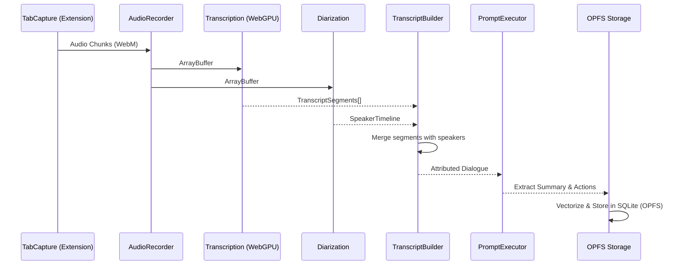

# Watchn't V3 — Master Engineering Specification

> **Document Type**: Engineering RFC + Architecture Overview
> **Version**: 3.0.0
> **Status**: Approved (Architecture Freeze)

---

## 1. Product Vision

Watchn't V3 is a **local-first, privacy-focused AI meeting copilot** built natively as a browser extension. It captures tab audio, transcribes it, extracts actionable intelligence (summaries, decisions, action items), and retains semantic memory entirely within the browser using OPFS (Origin Private File System) and WebGPU.

The legacy Python/FastAPI backend has been retired. Everything is now a TypeScript-first monorepo using standard web APIs.

---

## 2. Monorepo Architecture

The monorepo follows a strict **"Ultimate Layered Architecture"**, meaning dependencies flow inward. 

```mermaid
graph TD
    %% Apps Layer
    subgraph Apps [Apps Layer (UI & Runtimes)]
        ext[apps/extension (Vite + CRX)]
        web[apps/web (Next.js Dashboard)]
    end

    %% Domain Layer
    subgraph Domain [Domain Layer (Business Logic)]
        meet[@watchnt/meeting]
        work[@watchnt/workflows]
        exp[@watchnt/export]
    end

    %% AI Layer
    subgraph AI [AI Layer (Intelligence & ML)]
        aud[@watchnt/audio]
        trans[@watchnt/transcription]
        diar[@watchnt/diarization]
        intell[@watchnt/intelligence]
        mem[@watchnt/memory]
        emb[@watchnt/embeddings]
        prmpt[@watchnt/prompts]
        srch[@watchnt/search]
    end

    %% Platform Layer
    subgraph Platform [Platform Layer (Infrastructure)]
        core[@watchnt/core]
        stor[@watchnt/storage]
        prov[@watchnt/providers]
        plug[@watchnt/plugins]
    end

    %% Foundation Layer
    subgraph Foundation [Foundation Layer (Primitives)]
        cmd[@watchnt/commands]
        cfg[@watchnt/config]
        cntr[@watchnt/contracts]
        evnt[@watchnt/events]
        feat[@watchnt/features]
        jobs[@watchnt/jobs]
        pol[@watchnt/policies]
        shrd[@watchnt/shared]
        stat[@watchnt/state]
        tlm[@watchnt/telemetry]
    end

    %% Cross-cutting
    subgraph Testing [Testing Framework]
        tst[@watchnt/testing]
    end

    %% Flow (Dependencies go down)
    Apps --> Domain
    Apps --> Platform
    Domain --> AI
    AI --> Platform
    Platform --> Foundation
```

### 2.1 Dependency Rules
- **Apps** depend on Domain and Platform.
- **Domain** contains business models (`Meeting`) and orchestrates flows, depending on AI and Platform.
- **AI** provides ML capabilities (Whisper, LLM prompts) but does not know about Domain entities.
- **Platform** handles OS/Browser APIs (Storage, Network).
- **Foundation** has no dependencies. It provides primitives (Events, State).

---

## 3. Data Flow

The AI extraction follows a sequential pipeline over immutable chunks of data directly in the browser:



---

## 4. State Management & Storage

### 4.1 Persistence (OPFS)
- **SQLite via OPFS**: Replaces PostgreSQL. All meeting data, segments, and speakers are stored locally in a SQLite database persisted to the Origin Private File System.
- **Vector Search**: Memory and embeddings search happens locally.
- **Blobs**: Audio WebM files are written directly to OPFS.

### 4.2 Client State
- **Zustand**: UI state management.
- **RxJS / Events**: Core platform telemetry and event bus.

---

## 5. Build System

- **Turborepo**: Manages the dependency graph across 30+ packages.
- **pnpm**: Strict workspace definitions.
- **TypeScript**: `tsc` compiles packages to `dist/index.js` (No `tests/` directories are included in the build to prevent `dist/src` nested output bugs).
- **Vitest**: Runs fast in-memory unit/integration tests across packages.

To build the project:
```bash
npx pnpm install
npx pnpm run build
npx pnpm run test
```
